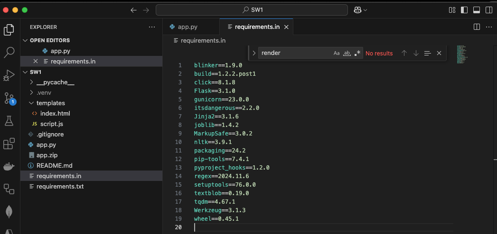

# Lernjournal 1 Python

## Repository und Library

| Repository (URL)  | https://github.com/yanickfischer/SW1_TextManipulation.git
| Kurze Beschreibung der App-Funktion | To-Do-Liste mit Text-Manipulation |
| Verwendete Library aus PyPi (Name) | textblob, nltk, flask, gunicorn |
| Verwendete Library aus PyPi (URL) | [https://pypi.org/project/textblob/](https://pypi.org/project/textblob/, https://pypi.org/project/nltk/, https://pypi.org/project/Flask/, https://pypi.org/project/gunicorn/)|
| Location deployed Application| https://mdm-lj1-app.azurewebsites.net/|
| ... | |

## App, Funktionalität
Die Webanwendung erlaubt es, einfache Aufgaben (To-Dos) einzugeben, anzuzeigen und zu löschen.  
Zusätzlich wird zu jeder eingegebenen Aufgabe eine Textanalyse durchgeführt:

- Rückwärtsdarstellung des Satzes
- Wortanzahl
- Buchstabenanzahl
- Palindrom-Erkennung

Die Ergebnisse werden unterhalb der Aufgabenliste dargestellt. Die gesamte Logik basiert auf **Flask im Backend** und wird im Frontend mit **HTML, Bootstrap 5 und Vanilla JS** angezeigt.

---


## Dependency Management

- Virtuelle Umgebung mit `venv` erstellt (`.venv`)
- Manuelle Pflege der Abhängigkeiten in `requirements.in`
- Automatische Erstellung der `requirements.txt` mit `pip-compile` (Tool: `pip-tools`)
- Reproduzierbarkeit gewährleistet durch fixierte Versionen
- Verwendete Haupt-Libraries:
  - `flask` – Web-Framework
  - `textblob` – einfache Textverarbeitung
  - `nltk` – Natural Language Toolkit
  - `gunicorn` – WSGI-Server für Deployment

Beispiel für requirements.in:
```txt
flask
gunicorn
textblob
nltk
```


## Deployment

Für das Deployment der Webapplikation wurde Microsoft Azure verwendet.
Das lokal entwickelte Flask-Projekt wird ZIP-Datei auf einen Azure App Service deploye und steht somit der Öffentlichkeit zur Verfügung.
Nachfolgend die vorgenommenen Schritte zum Deployment mit Azure.

**1. Projekt vorbereiten (ZIP-Archiv erstellen)** 
Zuerst wurde das Projekt als ZIP-Datei verpackt, wobei temporäre Dateien (z.B. .venv) ausgeschlossen wurden: zip -r deployment.zip . -x "*.venv*" "*.git*" "__pycache__/*"

**2. Azure Ressource anlegen**
Es wurde eine neue Ressourcengruppe, ein App Service Plan und eine Web-App mit Python Runtime erstellt. Dabei wurde die Version Python 3.13 gewählt und ein frei wählbarer App-Name vergeben:
```
az group create --name mdm-lj1-rg --location westeurope
```

**3. Azure App Service PLan erstellen**
```
az appservice plan create \
  --name mdm-lj1-plan \
  --resource-group mdm-lj1-rg \
  --sku F1 \
  --is-linux
```

**4. Web App erstellen (mit Python 3.10)**
```
# Web App erstellen (mit Python 3.10)
az webapp create \
  --resource-group mdm-lj1-rg \
  --plan mdm-lj1-plan \
  --name mdm-lj1-app \
  --runtime "PYTHON|3.10"
```
**5. Aufruf der Applikation nach Deployement**

Die Applikation ist bei Azure verfügbar: https://mdm-lj1-app.azurewebsites.net/

