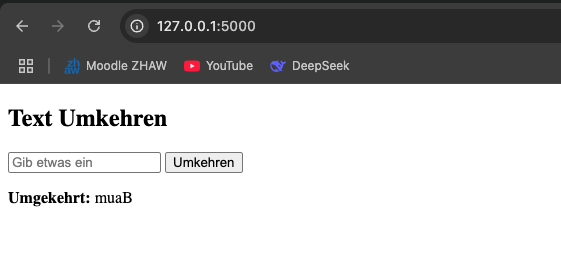
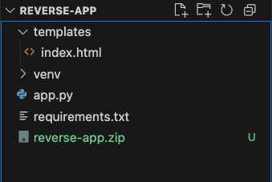
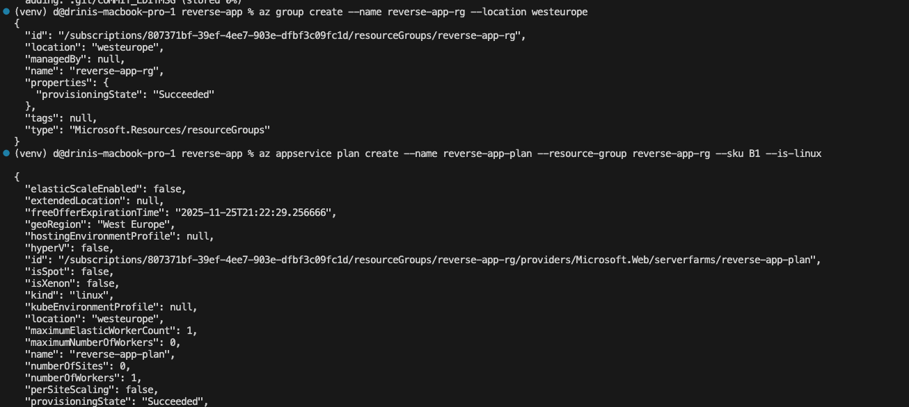
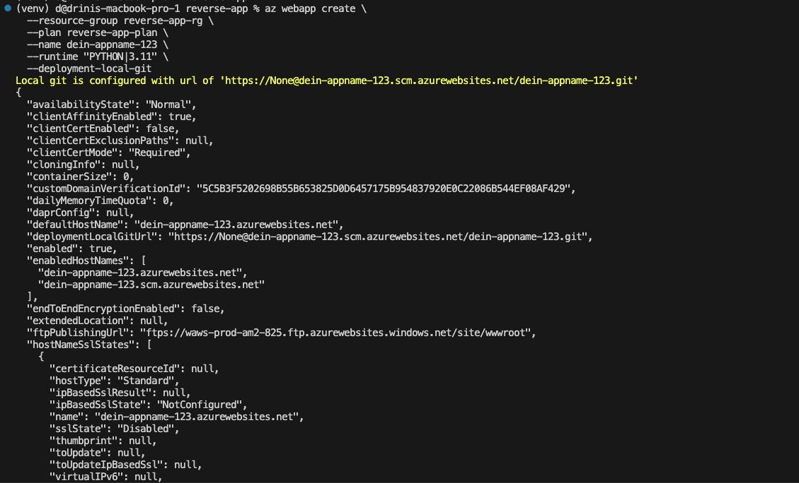
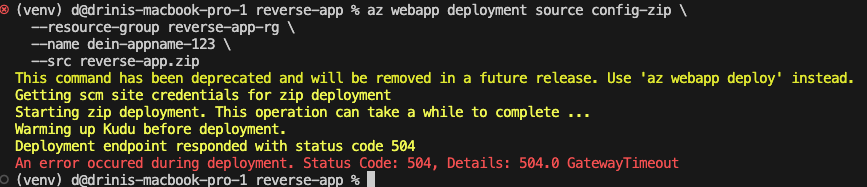

# Lernjournal 1 Python – Textumkehr-App

## Repository und Library

| Bestandteil | Beschrieb, Fundort |
|-------------|----------------------|
| Repository (URL) | https://github.com/seldri/reverse-app.git |
| Kurze Beschreibung der App-Funktion | Die App nimmt einen eingegebenen Text und gibt diesen umgekehrt aus. |
| Verwendete Library aus PyPi (Name) | Flask |
| Verwendete Library aus PyPi (URL) | https://pypi.org/project/Flask/ |
| Location deployed Application | Deployment auf Azure (siehe unten), aktuell fehlgeschlagen (504 Gateway Timeout) |

## App, Funktionalität

Die Anwendung besteht aus einer einfachen HTML-Seite, bei der der Benutzer einen Text eingibt. Nach dem Absenden wird der Text umgekehrt dargestellt.

Beispiel:
- Eingabe: `Baum`
- Ausgabe: `muaB`

Die App basiert auf **Flask im Backend**. Die Umkehrung erfolgt über Python-String-Slicing.

  
*Abb. 1: Die lokale Anwendung zeigt korrekt den umgekehrten Text.*

## Projektstruktur

Das Projekt enthält:
- `app.py`: Flask-Hauptapplikation
- `templates/index.html`: HTML-Frontend
- `requirements.txt`: Abhängigkeiten
- `reverse-app.zip`: Deployment-Archiv

  
*Abb. 2: Projektstruktur in VSCode.*

## Deployment mit Azure

### 1. Ressourcengruppe erstellen

```bash
az group create --name reverse-app-rg --location westeurope
```

  
*Abb. 3: Erstellung der Ressourcengruppe.*

### 2. App Service Plan erstellen

```bash
az appservice plan create \
  --name reverse-app-plan \
  --resource-group reverse-app-rg \
  --sku B1 \
  --is-linux
```

  
*Abb. 4: App Service Plan wurde erfolgreich erstellt.*

### 3. Web App erstellen

```bash
az webapp create \
  --resource-group reverse-app-rg \
  --plan reverse-app-plan \
  --name dein-appname-123 \
  --runtime "PYTHON|3.11" \
  --deployment-local-git
```

  
*Abb. 5: Die Web-App wurde erstellt und lokales Git-Deployment eingerichtet.*

### 4. Deployment via ZIP-Datei (fehlgeschlagen)

```bash
az webapp deployment source config-zip \
  --resource-group reverse-app-rg \
  --name dein-appname-123 \
  --src reverse-app.zip
```

  
*Abb. 6: Deployment schlägt fehl mit einem 504 Gateway Timeout.*

## Fazit

Die App funktioniert lokal zuverlässig und erfüllt die vorgesehene Funktion der Textrückwärtstransformation.  
Das Deployment auf Azure war im ersten Versuch nicht erfolgreich. Es wird empfohlen, den Vorgang mit einem alternativen Befehl (`az webapp deploy`) oder über ein verbundenes Git-Repository erneut durchzuführen.
