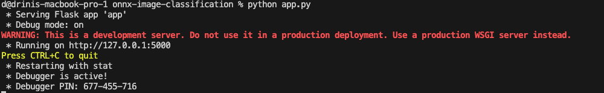
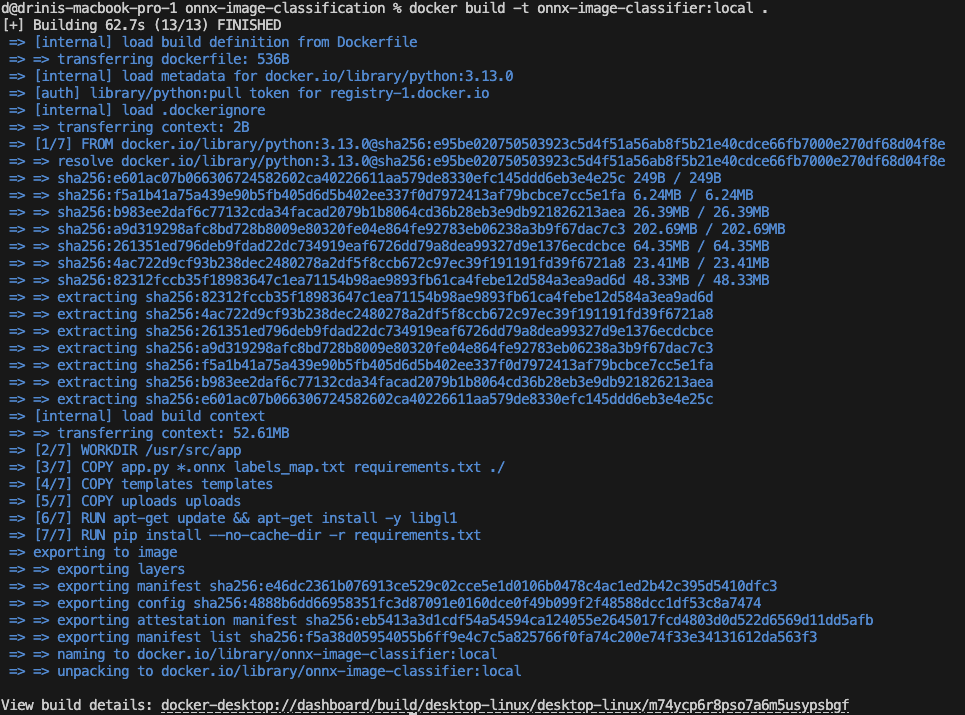
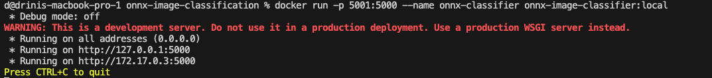
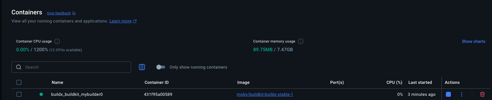
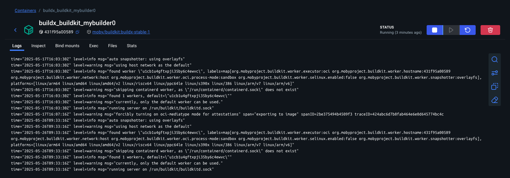
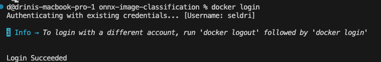
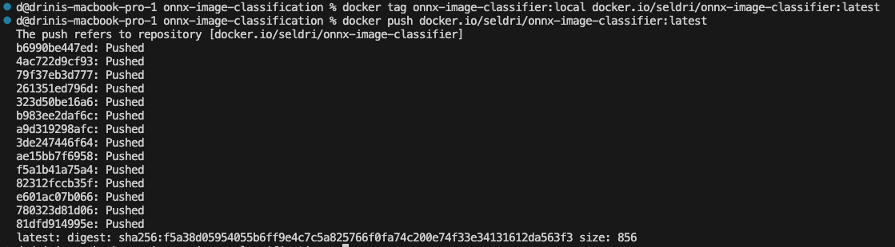
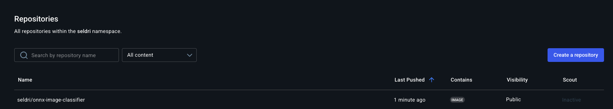

# Lernjournal 4 ONNX (Lite0)

## Übersicht

| | Beschreibung |
| -------- | ------- |
| Modellklassifikation mit App | [Projekt auf GitHub](https://github.com/seldri/models) |
| Applikations-Repo | https://github.com/seldri/onnx-image-classification.git |

---

## 1. Ziel und Setup

Ziel war es, ein kleineres ONNX-Modell (**EfficientNet-Lite0**) für Bildklassifikation lokal zu betreiben.  
Im ersten Schritt wurde **kein Dockerfile** verwendet – die App wurde direkt über Python gestartet.

```bash
pip install -r requirements.txt
python app.py
```

---

## 2. Projektstruktur

Das Projekt besteht aus folgenden Dateien und Ordnern:

- `app.py` – Hauptskript mit der Flask-Anwendung, die das ONNX-Modell lädt und Bilder klassifiziert
- `efficientnet_lite0.onnx` – Das kleinere ONNX-Modell für Bildklassifikation (EfficientNet-Lite0)
- `labels_map.txt` – JSON-Datei mit den Klassennamen für die Modellvorhersagen
- `requirements.txt` – Liste aller benötigten Python-Bibliotheken (z. B. Flask, onnxruntime, numpy, opencv)
- `templates/index.html` – Das HTML-Frontend der Webanwendung (Upload-Button, Anzeige der Vorhersage)
- `uploads/test_images/` – Ordner mit Beispielbildern für Testzwecke


---

## 3. Lokales Deployment (ohne Docker)

Die Anwendung kann direkt lokal gestartet werden, nachdem alle Abhängigkeiten installiert wurden.  
Dies ist ideal für die schnelle Entwicklung und das Testen der App.

```bash
python app.py
```

Die Anwendung läuft daraufhin lokal unter:  
**http://127.0.0.1:5000**



---

## 4. Container Build mit Dockerfile

Im nächsten Schritt wurde ein `Dockerfile` erstellt, um die Applikation in einem Container zu betreiben.  
Dies ermöglicht eine einfache und konsistente Ausführung auf jedem System mit Docker.

### Dockerfile-Inhalt

```dockerfile
# Basis-Image mit Python
FROM python:3.13.0

# Arbeitsverzeichnis im Container
WORKDIR /usr/src/app

# Kopiere Projektdateien in den Container
COPY app.py *.onnx labels_map.txt requirements.txt ./
COPY templates templates
COPY uploads uploads

# Installiere Abhängigkeiten
RUN apt-get update && apt-get install -y libgl1
RUN pip install --no-cache-dir -r requirements.txt

# Flask-App starten
EXPOSE 5000
CMD ["python", "-m", "flask", "run", "--host=0.0.0.0"]
```

### Build-Befehl

```bash
docker build -t onnx-image-classifier:local .
```



---

## 5. Docker-Container lokal starten

Der erstellte Container wurde danach gestartet:

```bash
docker run -p 5001:5000 --name onnx-classifier onnx-image-classifier:local
```

Die Anwendung war danach unter  
**http://127.0.0.1:5001**  
im Browser erreichbar.



---

## 6. Container-Status und Logs in Docker Desktop

Die Container-Übersicht sowie Logs wurden über Docker Desktop überprüft.  
Dies zeigt, dass das Image erfolgreich ausgeführt wird:

Container Status:
  

Container Logs:


---

## 7. Push des Docker-Images auf Docker Hub

Nach erfolgreichem Build und lokalem Test des Containers wurde das erstellte Docker-Image auf Docker Hub veröffentlicht.

### Schritte

1. Zuerst in Docker Hub einloggen:

```bash
docker login
```



2. Das lokale Image mit dem Remote-Namen taggen:

```bash
docker tag onnx-image-classifier:local docker.io/seldri/onnx-image-classifier:latest
```

3. Das Image auf Docker Hub pushen:

```bash
docker push docker.io/seldri/onnx-image-classifier:latest
```



4. Das Repository erscheint daraufhin im eigenen Docker Hub Account:  
**https://hub.docker.com/r/seldri/onnx-image-classifier**



---

## 8. Azure Web App Deployment (optional)

Um das Docker-Image als Web App in Azure zu deployen, kann folgender Ablauf genutzt werden:

1. Erstelle eine Ressourcengruppe:
   ```bash
   az group create --name onnx-rg --location westeurope
   ```

2. Erstelle einen App Service Plan:
   ```bash
   az appservice plan create --name onnx-plan --resource-group onnx-rg --is-linux --sku B1
   ```

3. Erstelle die Web App mit Docker-Image:
   ```bash
   az webapp create --resource-group onnx-rg --plan onnx-plan --name onnx-classifier-app --deployment-container-image-name seldri/onnx-image-classifier:latest
   ```

4. Setze die Konfiguration, falls erforderlich (z. B. Port):
   ```bash
   az webapp config appsettings set --resource-group onnx-rg --name onnx-classifier-app --settings WEBSITES_PORT=5000
   ```

Die App ist danach über eine generierte Azure-URL im Browser erreichbar.
