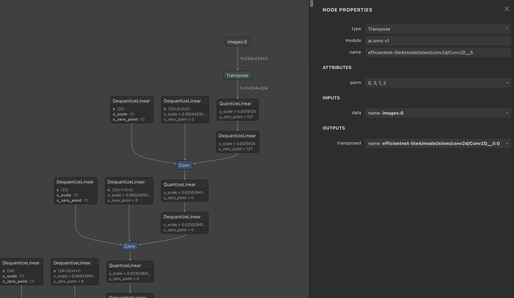
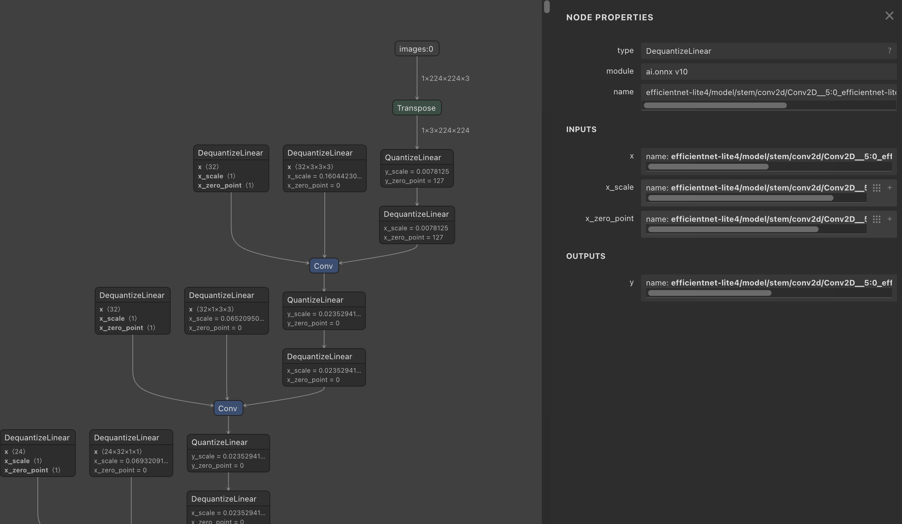
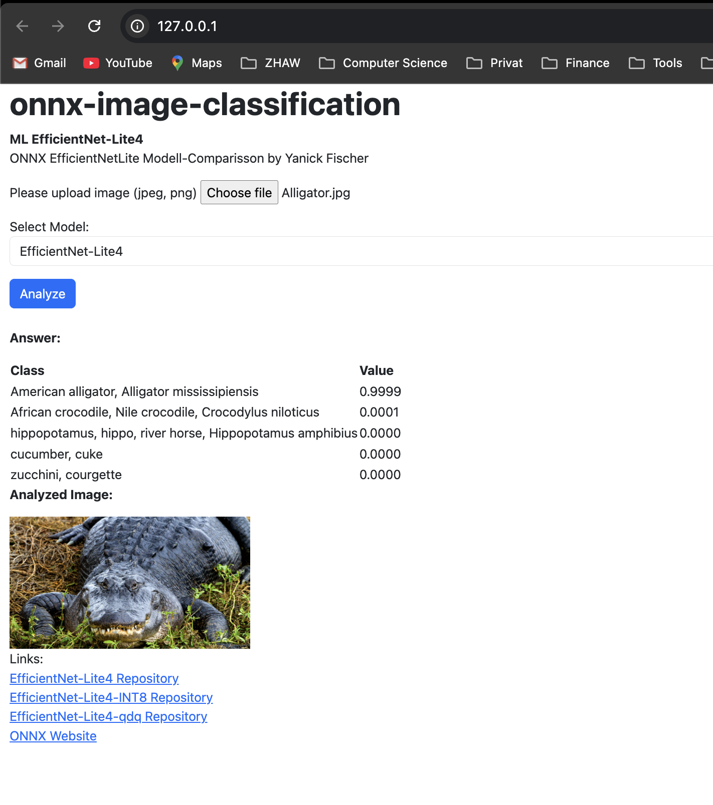
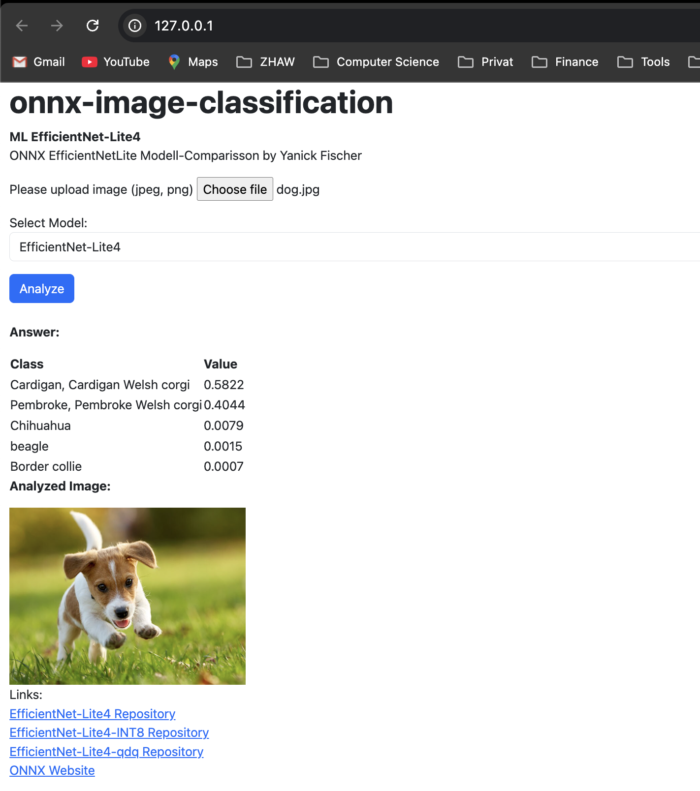
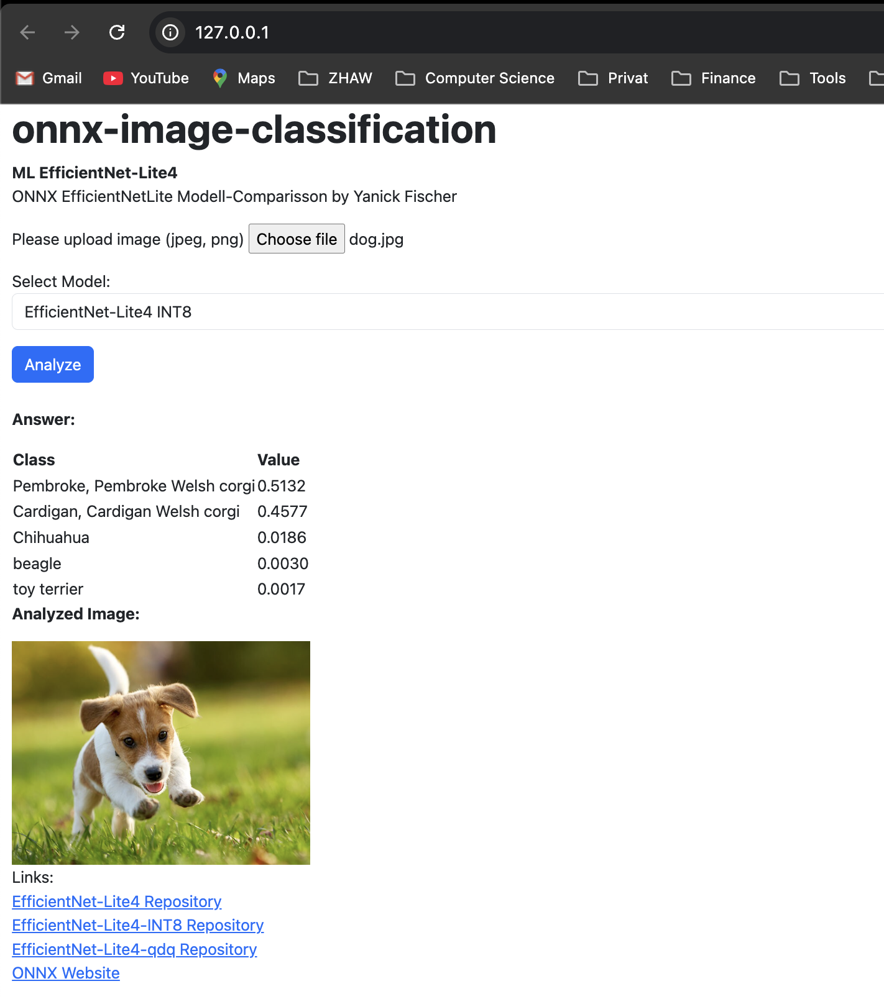
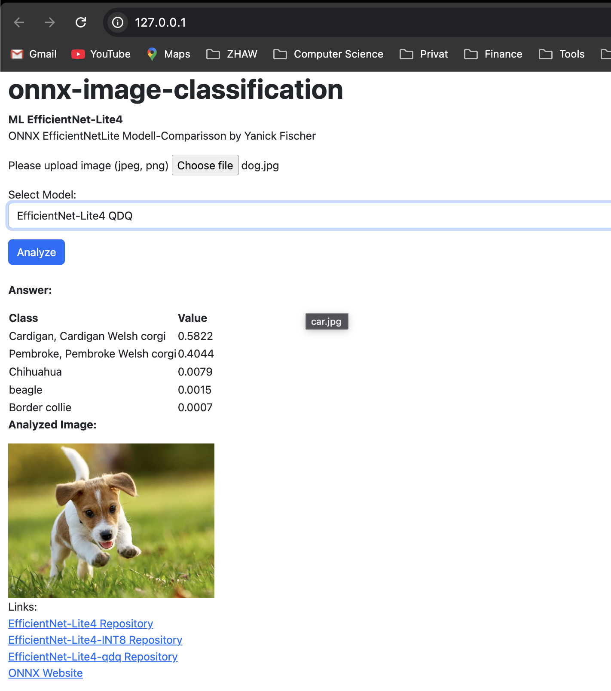
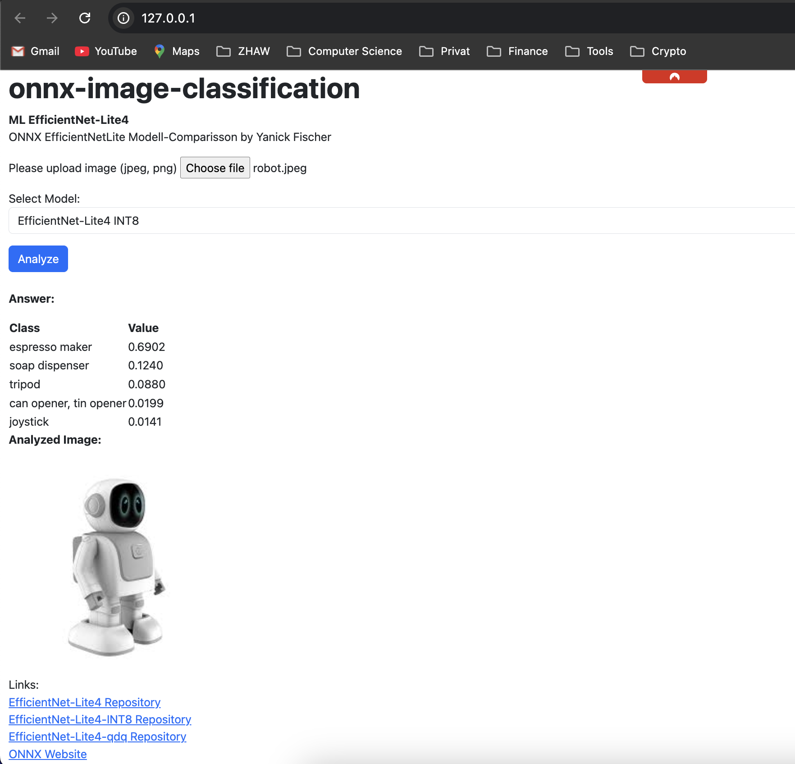
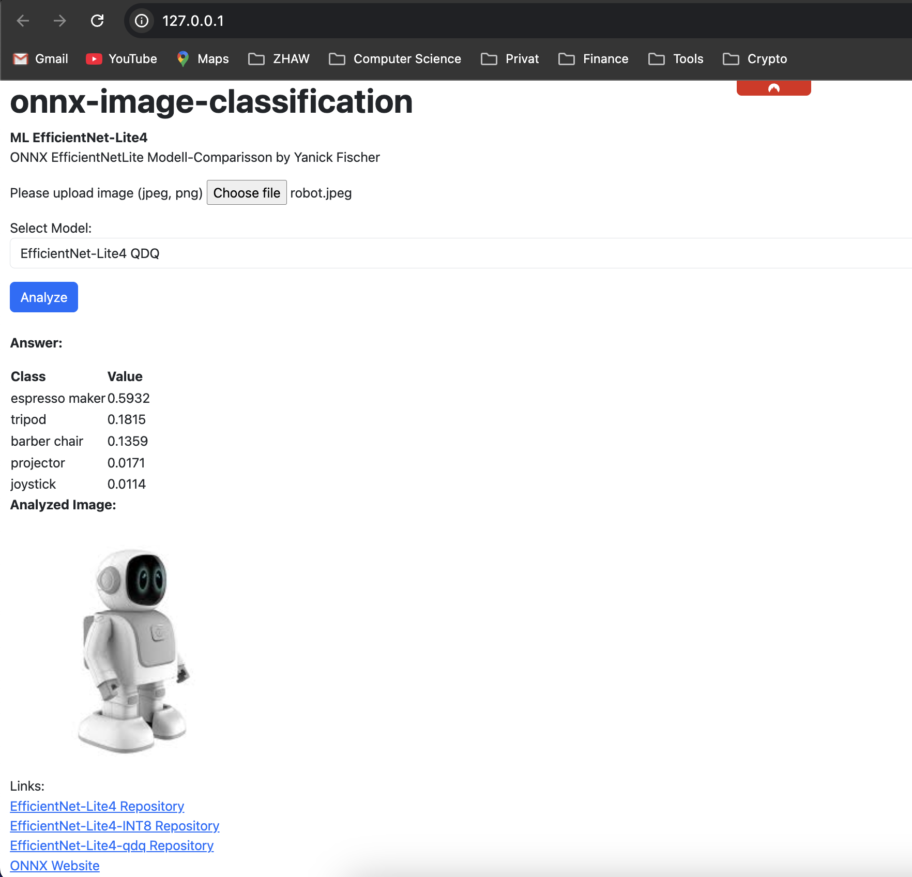
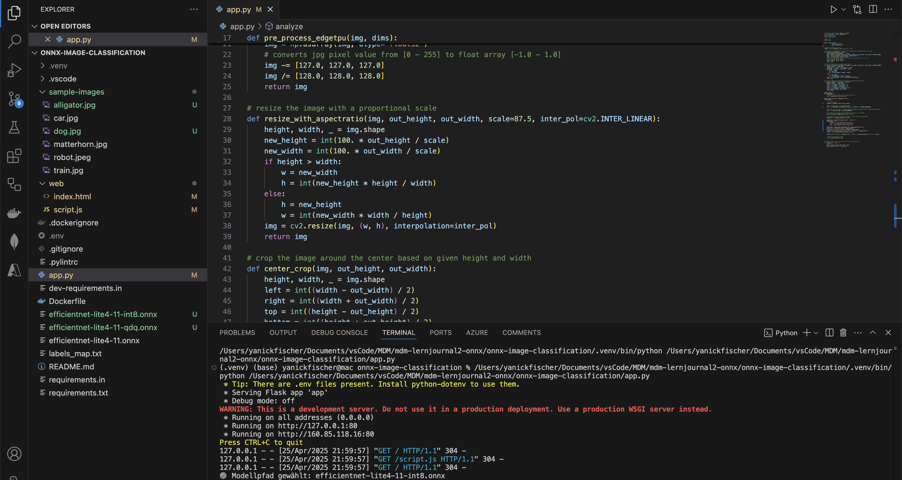
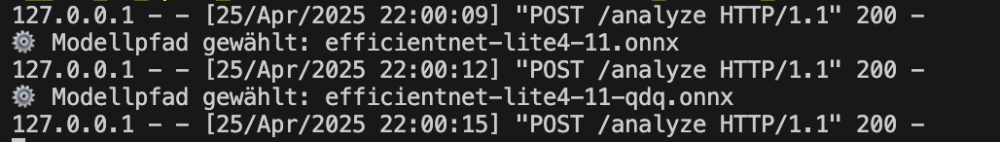

# Lernjournal 3 ONNX

## Übersicht

| | Bitte ausfüllen |
| -------- | ------- |
| ONNX Modell für Analyse (Netron) | https://github.com/onnx/models/blob/main/validated/vision/classification/efficientnet-lite4/model/efficientnet-lite4-11-qdq.onnx |
| onnx-image-classification Fork (EfficientNet-Lite) | https://github.com/yanickfischer/onnx-image-classification |

## Dokumentation ONNX Analyse

Im Rahmen dieser Aufgabe wurde ein bestehendes EfficientNet-Lite4-Modell im ONNX-Format analysiert. Ziel war es, ein kleineres, quantisiertes Modell (QDQ = Quantize-Dequantize) zu untersuchen, welches für ressourcenschonende Anwendungen optimiert ist. Dazu wurde die ONNX-Datei mit dem Tool [Netron](https://netron.app) geöffnet und drei exemplarische Layers dokumentiert.

Diese Analyse entspricht direkt der Aufgabenstellung im Lernjournal:
- **Ein ONNX-Modell analysieren**
- **Den Aufbau und die Funktionsweise mit Netron visualisieren**
- **Komplexität und Modellstruktur nachvollziehen**

---

## Layer 1: Transpose

Dieser Layer bringt die Bilddaten vom klassischen NHWC-Format (Height × Width × Channels) ins NCHW-Format (Channels × Height × Width), wie es für viele ONNX-Modelle erforderlich ist:



✅ Das ist wichtig, damit das Modell korrekt rechnen kann.

---

## Layer 2: Dequantize ➔ Conv ➔ Quantize


- `DequantizeLinear` wandelt die vorliegenden uint8-Werte (z. B. 0–255) in Gleitkommazahlen um, damit die Convolution auf realen Werten arbeiten kann
- `Conv` führt die Faltung durch – dabei werden Feature Maps erzeugt, die erste relevante Merkmale (z. B. Kanten, Farben) extrahieren
- `QuantizeLinear` transformiert die Ergebnisse wieder zurück in quantisierte Form

✅ Kombination aus Performance (Quantisierung) und Genauigkeit (kurzzeitige Dequantisierung für die Berechnung)

---

## Layer 3: Vertiefte Struktur

Hier wiederholt sich das Muster aus mehreren Dequantisierungen, Convolution-Operationen und ggf. Aktivierungen:



- In dieser Tiefe erkennt das Netzwerk bereits komplexere Muster (z. B. Umrisse von Objekten, Texturen)
- Es zeigt auch, wie stark QDQ-Strukturen das Modell dominieren

✅ Die Struktur hilft, das Modell klein und effizient zu halten – ideal für mobile Anwendungen.

## Dokumentation onnx-image-classification

In dieser Aufgabe hat es sich angeboten, dem User direkt alle 3 Modelle zur Verfügung zu stellen und über einen Selektor auswählen zu lassen.
So kann ein ganz einfacher und schneller Vergleich gemacht werden.
*->Die Code Anpassungen an app.py / script.hs / index.html werden am Ende dieses Kapitel unter der Überschrift "Anpassungen für einfache Model-Selektion" beschrieben.*

Ich habe den Modellvergleich durchgeführt und konnte folgende Unterschiede feststellen:

## Modellvergleich: Prediction Accuracy bei drei Testbildern

| Bild      | Modell                 | Top-1 Prediction                        | Confidence |
|-----------|------------------------|-----------------------------------------|------------|
| Alligator | EfficientNet-Lite4     | American alligator                      | 0.9999     |
| Alligator | EfficientNet-Lite4 INT8| American alligator                      | 0.9999     |
| Alligator | EfficientNet-Lite4 QDQ | American alligator                      | 0.9999     |
| Dog       | EfficientNet-Lite4     | Cardigan Welsh corgi                    | 0.5822     |
| Dog       | EfficientNet-Lite4 INT8| Pembroke Welsh corgi                    | 0.5132     |
| Dog       | EfficientNet-Lite4 QDQ | Cardigan Welsh corgi                    | 0.5822     |
| Robot     | EfficientNet-Lite4     | Espresso maker                          | 0.4320     |
| Robot     | EfficientNet-Lite4 INT8| Espresso maker                          | 0.6902     |
| Robot     | EfficientNet-Lite4 QDQ | Espresso maker                          | 0.5932     |

Hier die Screenshots zum testbild alligator:



Hier die Screenshots zum testbild dog:




Hier die Screenshots zum testbild robot:




**Fazit:**
	•	🐊 Alligator wurde bei allen Modellen mit maximaler Sicherheit korrekt erkannt.
	•	🐕 Dog hatte leichte Unterschiede, INT8 bevorzugt Pembroke, andere Modelle Cardigan.
	•	🤖 Robot wurde durchgehend als Espresso maker klassifiziert, INT8 mit der höchsten Confidence.
 
### Anpassungen für einfache Model-Selektion
Um die Benutzerfreundlichkeit zu verbessern und einen direkten Modellvergleich zu ermöglichen, wurden verschiedene Code-Anpassungen vorgenommen.  
Neu kann der Benutzer über ein Dropdown-Menü eines von drei EfficientNet-Modellen auswählen und per Klick auf einen "Analyze"-Button die Bildanalyse starten.  
Dadurch ist ein einfacher Wechsel zwischen den Modellen möglich, ohne dass ein Seitenreload oder ein neuer Upload notwendig wird.
Die folgenden Codeanpassungen in `app.py`, `script.js` und `index.html` beschreiben die konkrete Umsetzung dieser Funktionalität.

Dass das funktioniert sieht man auch schon in der Konsole anhand der Konsolen-Ausgabe:
⚙️  Modellpfad gewählt: *HIER STEHT DER MODELLNAME*




#### Anpassungen app.py

Anstatt ein fixes Modell (`efficientnet-lite4-11.onnx`) zu laden, wird nun dynamisch eines von drei EfficientNet-Modellen ausgewählt, basierend auf dem Dropdown-Wert im Frontend.

```python
model_key = request.form.get("model", "default")
model_paths = {
    "default": "efficientnet-lite4-11.onnx",
    "int8": "efficientnet-lite4-11-int8.onnx",
    "qdq": "efficientnet-lite4-11-qdq.onnx"
}
model_path = model_paths.get(model_key, model_paths["default"])
ort_session = onnxruntime.InferenceSession(model_path)
```

#### Anpassungen script.js

1. Es wurde eine neue Funktion "submitForm" eingeführt:
```javascript
function submitForm() {
    const fileInput = document.getElementById("image");
    const modelSelect = document.getElementById("model");

    if (fileInput.files.length !== 1) {
        alert("Bitte genau eine Datei hochladen.");
        return;
    }

    const fileSize = fileInput.files[0].size / 1024 / 1024;
    if (fileSize > 10) {
        alert("Datei zu gross (max. 10Mb)");
        return;
    }
```
2. Weiter wurde die Variabel formData angepasst:
```javascript
const formData = new FormData();
    formData.append("image", fileInput.files[0]);
    formData.append("model", modelSelect.value);
```

#### Anpassungen index.html
1. Neu wurde ein Dropdown-Menü eingeführt, um dem Benutzer die Auswahl zwischen drei verschiedenen EfficientNet-Modellen zu ermöglichen.

```html
<div class="form-group mt-3">
    <label for="model">Select Model:</label>
    <select name="model" id="model" class="form-control">
        <option value="default">EfficientNet-Lite4</option>
        <option value="int8">EfficientNet-Lite4 INT8</option>
        <option value="qdq">EfficientNet-Lite4 QDQ</option>
    </select>
</div>
```
2. Das Formular sendet die Daten nicht mehr automatisch, sondern ruft beim Klick auf den Button eine JavaScript-Funktion auf (submitForm()), um Bild und Modellwahl an den Server zu schicken.
```html
<button type="button" class="btn btn-primary mt-3" onclick="submitForm()">Analyze</button>
```
#### Resultat dieser Anpassungen

**Der User kann nun ganz einfach die Modelle ändern!! :D** 

Das ist möglich dank:

✅ `checkFiles(files)` nur noch für Bildprüfung und Vorschau zuständig.  
✅ `submitForm()` wird erst auf Knopfdruck (Button-Click) ausgeführt.  
✅ Benutzer kann vorher Modell wählen im Dropdown (`#model`).  
✅ Antwort (`/analyze`) wird korrekt als Tabelle angezeigt.  
✅ Kein Seiten-Reload nötig.  
✅ Einfacher und schneller Vergleich der drei EfficientNet-Modelle möglich.  
