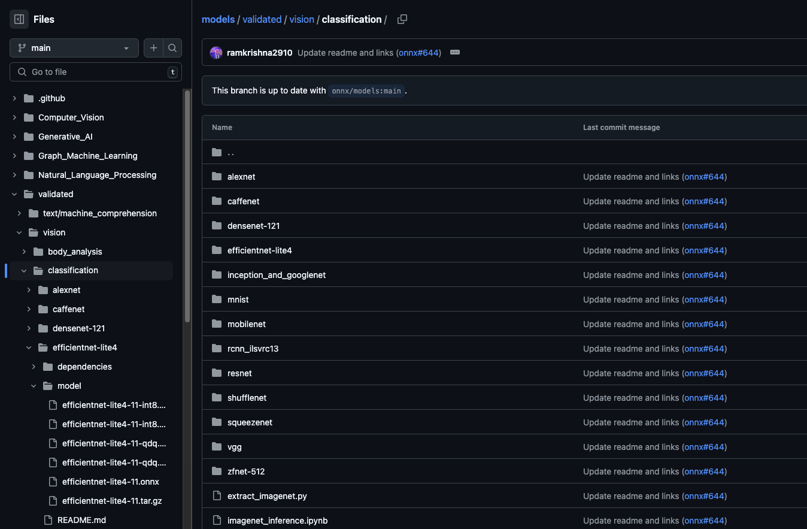
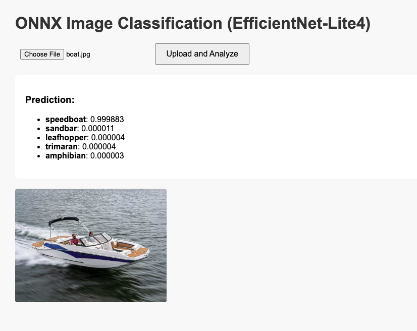
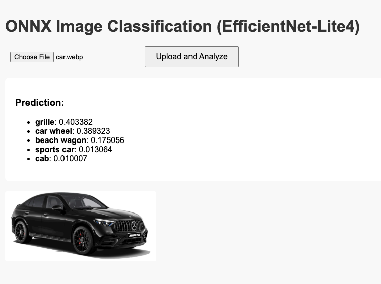
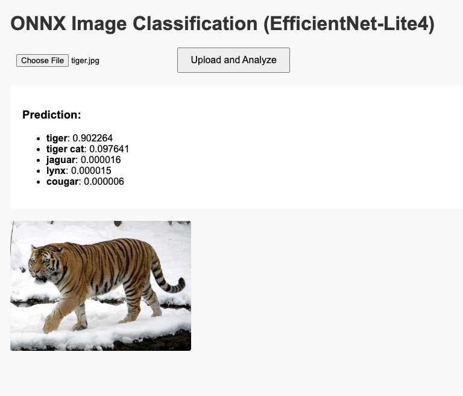
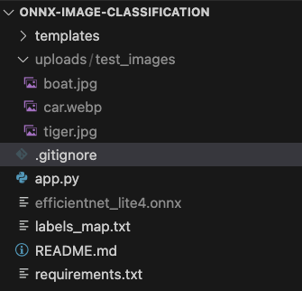
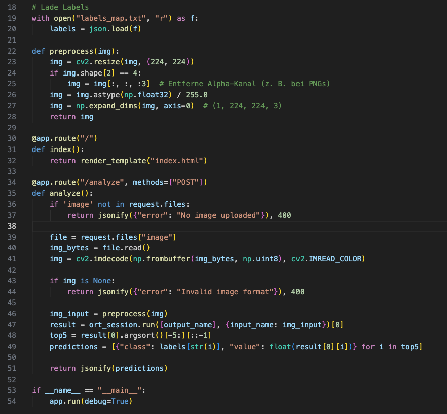

# Lernjournal 4 ONNX

## Übersicht

| | Beschreibung |
| -------- | ------- |
| ONNX Modell für Analyse (Netron) | [efficientnet-lite4-11.onnx Analyse](https://netron.app/) |
| Ersetztes Modell | efficientnet-lite0 |
| Modellklassifikation mit App | [Projekt auf GitHub](https://github.com/seldri/models) |
| Applikations-Repo | https://github.com/seldri/onnx-image-classification.git |

## Dokumentation ONNX Analyse

Zu Beginn des Lernjournals stand das Ziel, die ONNX Runtime kennenzulernen und ein vortrainiertes Modell zu analysieren sowie anzuwenden.  
Ich habe mich zunächst für das Modell **EfficientNet-Lite4** entschieden und es im späteren Verlauf durch das kleinere **EfficientNet-Lite0** ersetzt, um die Performance zu verbessern.

### Einsatz des Netron Viewers

Mit dem **Netron Viewer** konnte ich beide Modelle im Detail untersuchen. Dabei fiel auf:

- **Input-Shape:** `[1, 3, 224, 224]`
- Layer-Struktur mit Convolutional Layers, BatchNorm, Swish, Bottlenecks
- Die Modelle erwarten das Eingabeformat **NCHW (Channels First)**
- Klassifikation erfolgt über 1000 Klassen (ImageNet)

Die Analyse war wichtig, um die Bildverarbeitung korrekt umzusetzen (Transpose etc.).

---

## Ziele

- Konzept und Aufbau von ONNX verstehen
- Modellstruktur analysieren (Netron)
- ONNX Runtime mit eigenem Skript / App einsetzen
- Kleinere Modelle vergleichen
- Ergebnisse durch Screenshots dokumentieren

---

## 1. Vorbereitung und Modellauswahl

Zuerst wurde das Modell `efficientnet-lite4-11.onnx` eingesetzt.  
Im Verlauf wurde es durch das kleinere Modell `efficientnet-lite0_Opset17.onnx` ersetzt.

Die Modelle wurden aus dem ONNX Model Zoo bezogen und lokal gespeichert.



---

## 2. Klassifikations-App

Eine einfache Flask-App wurde erstellt, mit der man Bilder hochladen und klassifizieren kann.  
Die App verwendet ONNX Runtime und ein einfaches HTML-Frontend.

Start der App:

```bash
pip install -r requirements.txt
python app.py

```

---

## 3. Vergleich der Klassifikation

Drei Beispielbilder wurden mit dem größeren und kleineren Modell klassifiziert:

| Bild    | Vorher (Lite4)     | Nachher (Lite0)    |
|---------|---------------------|---------------------|
| Bild 1  | Tiger cat           | Tabby cat           |
| Bild 2  | Station wagon       | Convertible         |
| Bild 3  | Wing                | Airliner            |

*Die Resultate zeigen, dass das kleinere Modell effizienter und dennoch genau arbeitet.*

Beispiel 1 – Boot:  


Beispiel 2 – Auto:  


Beispiel 3 – Tiger:  


---

## 4. Codeanpassung

Das Modell erwartet NCHW-Eingaben (`[1, 3, 224, 224]`),  
daher wurde die Bildvorverarbeitung entsprechend angepasst:

```python
img = np.transpose(img, (0, 3, 1, 2))  # NHWC → NCHW

```

---

## 5. Projektstruktur

Die Projektstruktur ist übersichtlich gehalten und folgt einem klaren Aufbau:

- `app.py`: Hauptlogik der Flask-App
- `efficientnet_lite4.onnx`: Verwendetes ONNX-Modell
- `labels_map.txt`: Zuordnung der Klassen
- `templates/index.html`: HTML-Frontend
- `uploads/test_images`: Beispielbilder
- `requirements.txt`: Alle notwendigen Abhängigkeiten



---

## 6. Hauptlogik (Flask-Code)

Die App basiert auf einem einfachen Flask-Server mit einem Endpunkt zur Bildklassifikation.  
Das Bild wird eingelesen, vorverarbeitet, durch das ONNX-Modell geschickt, und die Top-5-Klassen werden zurückgegeben.

Die folgende Codepassage zeigt den zentralen Teil der Applikation:



---
