# Projekt 1 Python

## Übersicht

| | Bitte ausfüllen |
| -------- | ------- |
| Variante | Eigenes Projekt |
| Datenherkunft | JSON (Kyiv Independent News), CSV/JSON (Twitter-Daten, manuell und GPT-annotiert) |
| Datenherkunft | https://kyivindependent.com/ und manuell erhobene Tweets von https://x.com/ |
| ML-Algorithmus | Fine-tuning von `roberta-base` zur geopolitischen Sentimentanalyse |
| Repo URL | https://github.com/yanickfischer/mdm-ukraineBias |

## Dokumentation

### Data Scraping

1. Am Anfang des Projektes wurde Twitter-Daten gescrapt, welche als Basis für das Training vom `roberta-base` Modell genutzt werden:

2. Twitter-Daten wurden über ein Python-Skript (`twitter_scraper/scrape_balanced_sample.py`) aus archivierten Datensätzen geladen und in einer MongoDB-Datenbank gesammelt

3. Relevante Tweets wurden mithilfe von GPT-3.5-Turbo gefiltert und annotiert (`gpt_filter_sentiment/gpt_filter_sentiment.py`), um nicht relevante Tweets zu entfernen und relevante geopolitische Haltung zu klassifizieren.
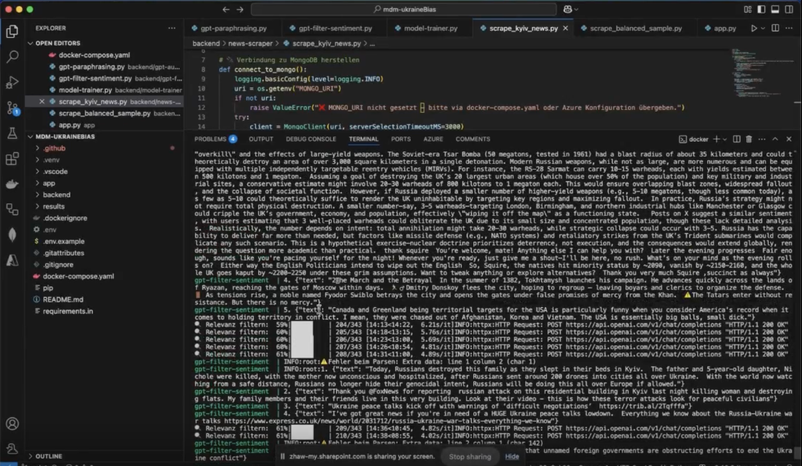
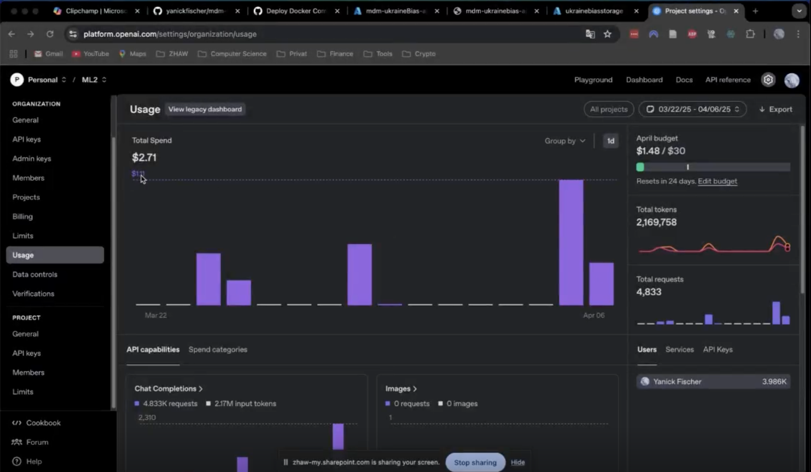

**Leider wurde im Verlauf des Projektes bei Twitter ein Update gemacht, was dazu geführt has, dass diese Form von Scraping nicht mehr möglich war**

4. Aus diesem Grund wurde ein weiteres Modul eingeführt, welches durch eine GPT-API Call ein Paraphrasing der bestehenden, gefilterten Tweets (bezogen aus Mongo DB) durchführte, damit mehr Daten für das spätere Training verfügbar waren

**In Absprache mit Adrian Moser wurde ein weiteres Scraping durchgeführt - um in der Scraping Sektion keine Punktabzüge zu erhalten**

5. Ergänzend wurde deshalb ein kleines weiteres Scraping durchgeführt.
News Scraping erfolgt über ein Scrapy-Spider-Modul (`kyiv_scraper.spiders.news`), welches Nachrichtenartikel von kyivindependent.com extrahiert und als `kyiv_news.json` speichert:
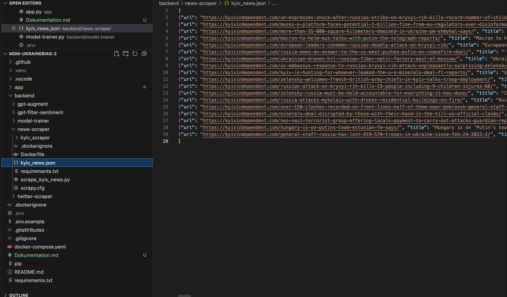
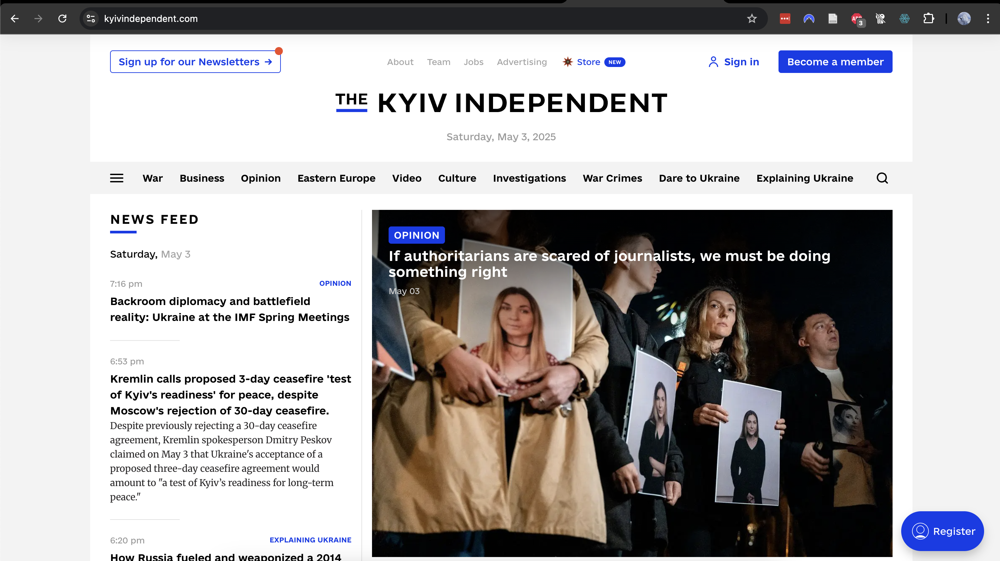

### 2. Training

1.	Aus der MongoDB-Collection labelled_augmentedCount_tweets_training werden Tweets mit gültigen Labels (0 = pro-Russland, 1 = neutral, 2 = pro-Ukraine) geladen und in ein Pandas-DataFrame überführt

2.	Die Datensätze werden mittels train_test_split in Trainings- und Validierungsdaten aufgeteilt. Die Verteilung erfolgt stratifiziert nach Label, um ein ausgewogenes Verhältnis zu gewährleisten

3.	Zur Tokenisierung wird das vortrainierte roberta-base Modell von Huggingface verwendet. Die Texte werden mit Truncation und Padding in geeignete Tensor-Form gebracht
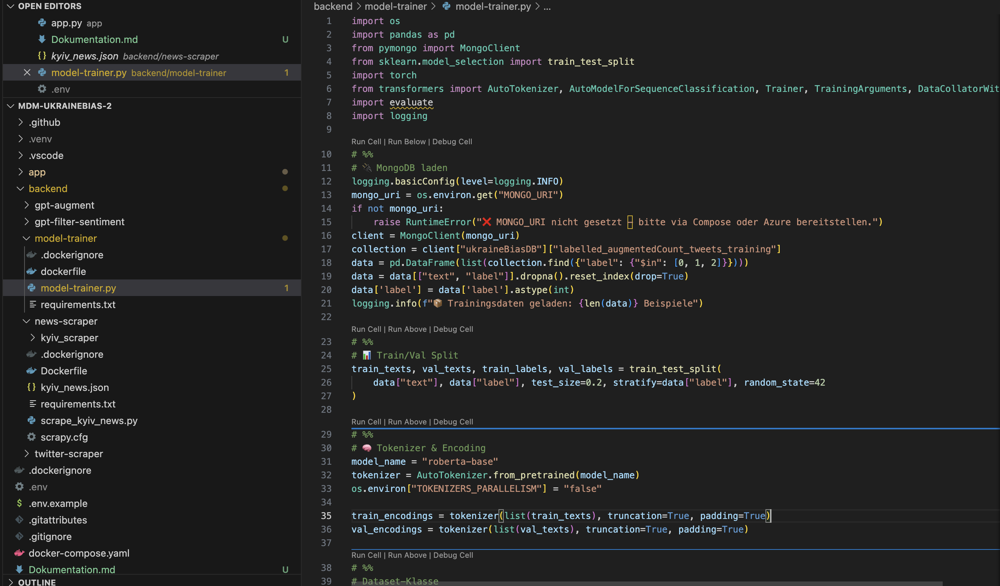

4.	Die Daten werden in benutzerdefinierten TweetDataset PyTorch-Datasets gekapselt, um sie dem Trainingsprozess zugänglich zu machen

5.	Für das Fine-Tuning des Modells wird Huggingface’s Trainer verwendet. Dabei kommen u. a. folgende Einstellungen zum Einsatz:
•	Trainingsbatchgröße: 8
•	Trainingsdauer: 3 Epochen
•	Evaluationsmetrik: Accuracy
•	Das beste Modell (höchste Accuracy) wird automatisch gespeichert

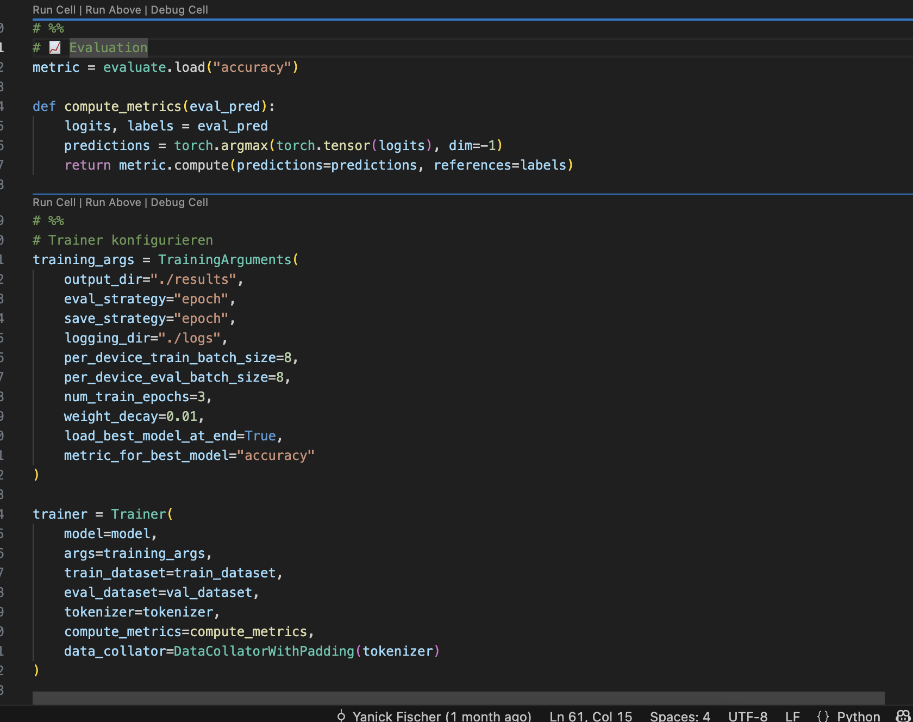

6.	Nach dem Training werden sowohl das Modell als auch der Tokenizer im Pfad app/model-final abgelegt. Diese persistierten Artefakte werden anschließend über eine Flask-API für Inferenz im Produktivsystem verwendet:

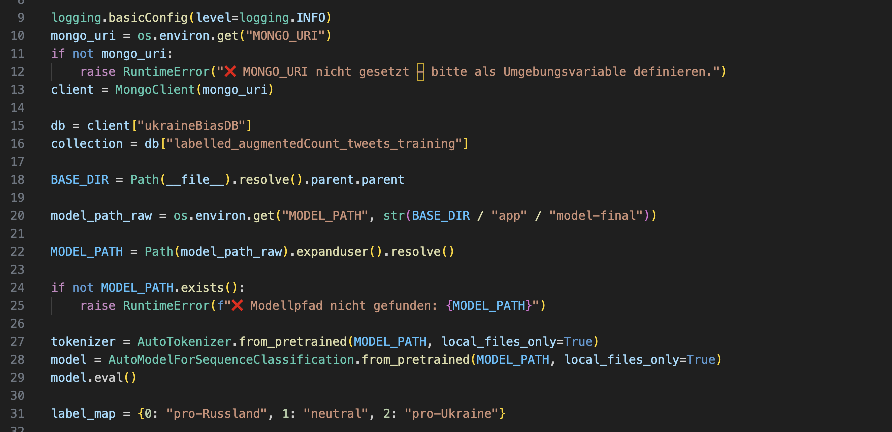
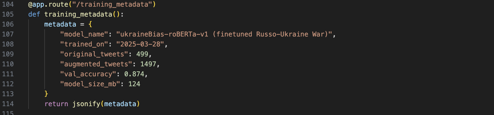

Die App läuft lokal und in Docker sauber und kann auch das Model richtig nutzen un Inferenzen machen:
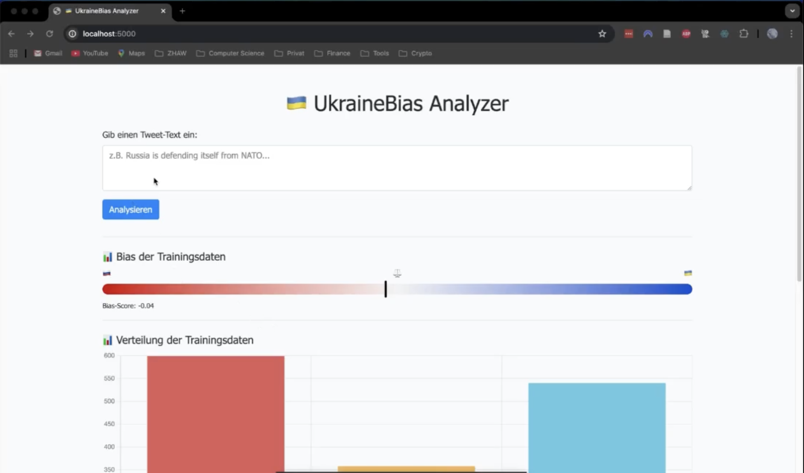
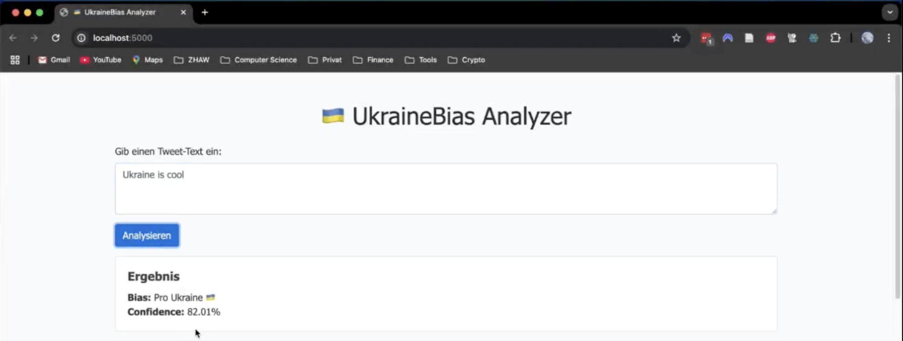
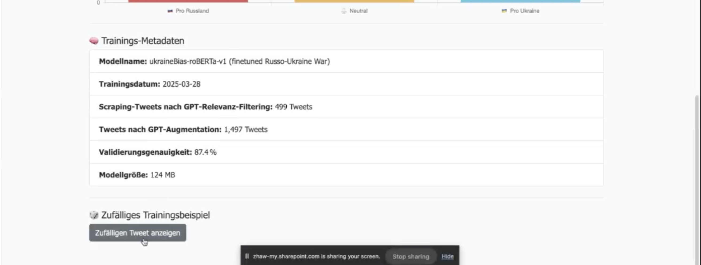
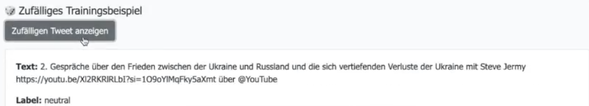
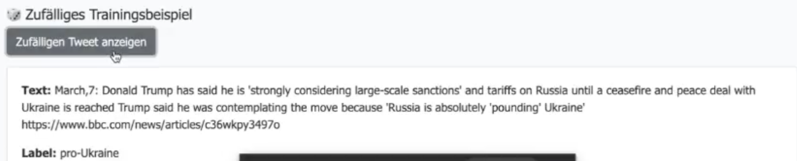

### 3. ModelOps Automation

1. Die Sentimentfilterung und GPT-Annotation wird über definierte Flask-Routen gestartet (`/filter_and_label`, `/augment`)

2. Das Modelltraining kann per API (`/train_model`) ausgelöst werden

3. Nachrichtenartikel können via Route `/run_news_spider` live aktualisiert und in die Datenbank geschrieben werden

4. Alle GPT-gestützten Module sind über Docker konfiguriert und auf minimale Ressourcenverwendung optimiert

5. GitHub Actions Workflows (definiert in .github/workflows/) ermöglichen eine automatisierte Ausführung von Modelltraining und Datenverarbeitung direkt aus dem Repository heraus. Diese Workflows können so konfiguriert werden, dass sie bei bestimmten Ereignissen (z. B. Pushes oder Pull Requests) ausgelöst werden, um kontinuierliche Integration und Bereitstellung sicherzustellen:
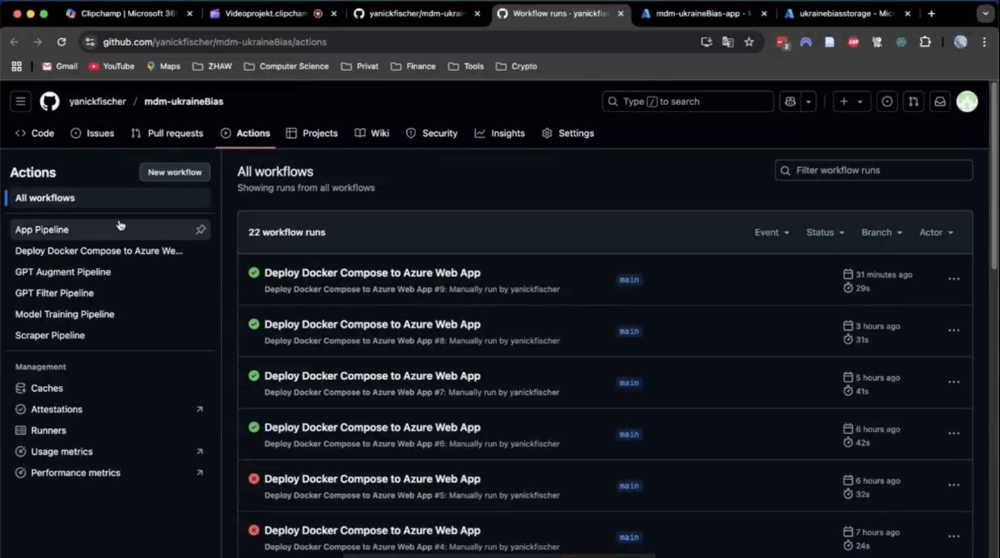

### 4. Deployment

1. Als Vorbereitung für das Deployment wurde die Applikation mit `docker-compose` containerisiert
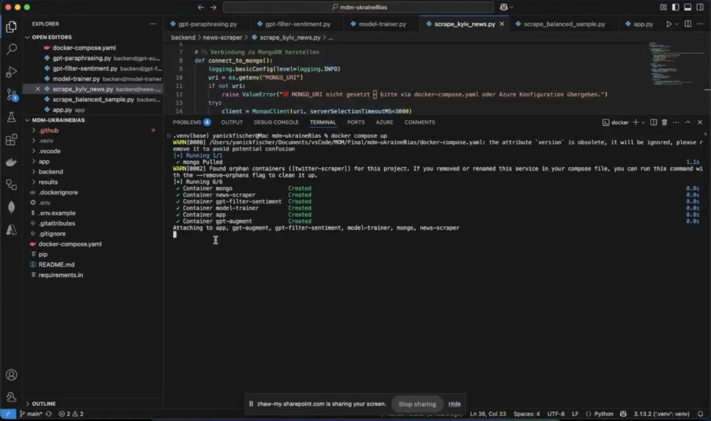

2. In Docker sieht man gut, dass alle Images sauber gestartet werden und die Applikation funktioniert
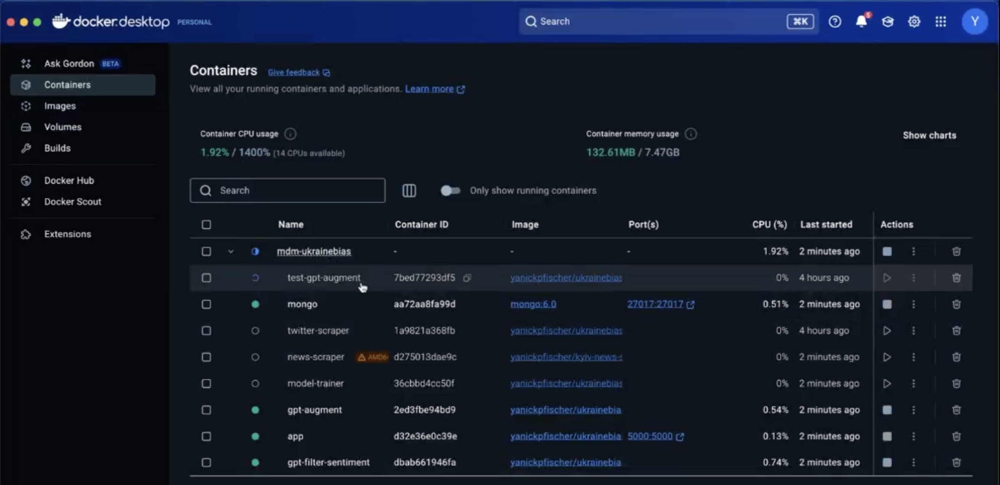

3. Die Images wurden anschliessend auf docker-hub veröffentlicht
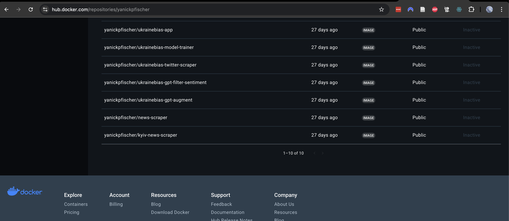

#### Azure Deployment
**Vorwort:**
Leider war das Deployement nicht ganz erfolgreich.
Die Erkentniss ist, dass die Architektur der Applikation in Micro-Services viel zu komplex war um das im Rahmen dieses Projektes umzusetzen.
Die Abhängigkeiten unter den verschiedenen Services (Python Modulen) sind zu  stark, als dass jedes Modul komplett losgelöst vom Rest ausführbar war.
Entsprechend schlug das Azure-Deployment mit Multi-Container-Deployment fehl und die Applikation lief in Azure nicht.

1. Das Deployement wurde einerseits über die regulären CLI Befehle, als auch über die Github Automation probiert
Hier die Ansicht in Azure der deployten App (welche halt leider nicht läuft):

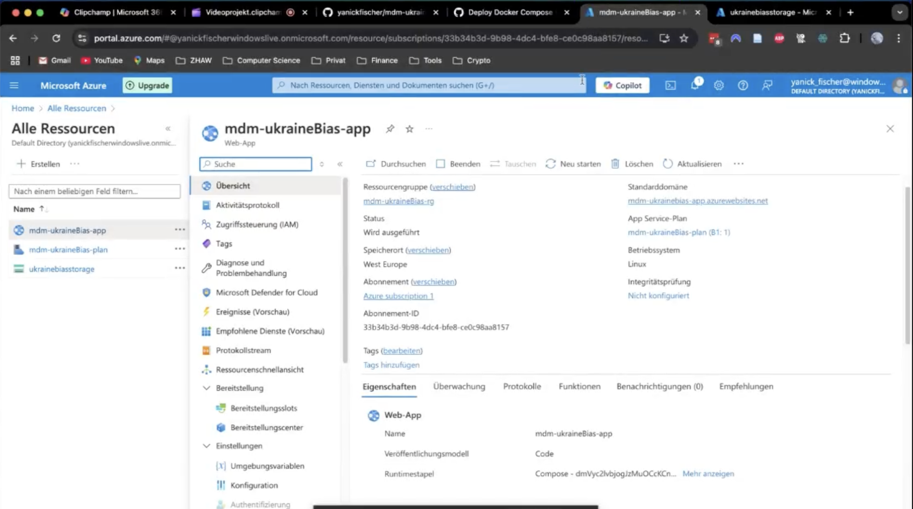

Hier sieht man die Ansicht beim Starten der Applikation:

2. Deployment erfolgt via Docker-Container, der sowohl Backend (API), GPT-Module als auch das Modell beinhaltet
3. Das Model wurde zusätzlich via Blob-Storage auf Azure deployed:
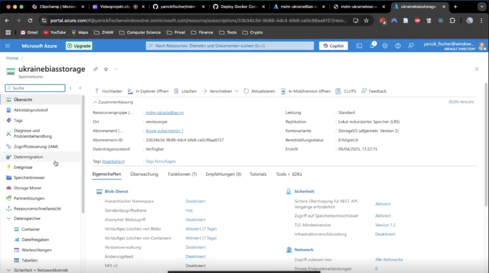
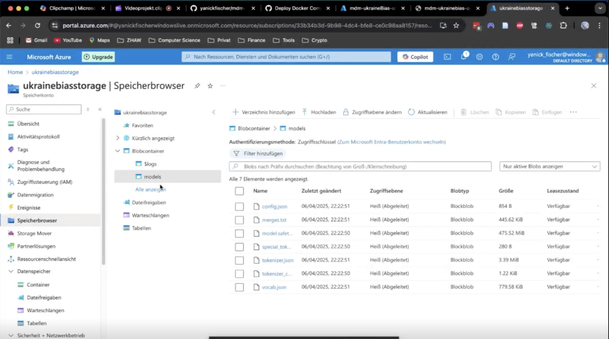

5. Die Anwendung ist für Azure Web App vorbereitet – MongoDB kann über Azure Cosmos DB angebunden werden

