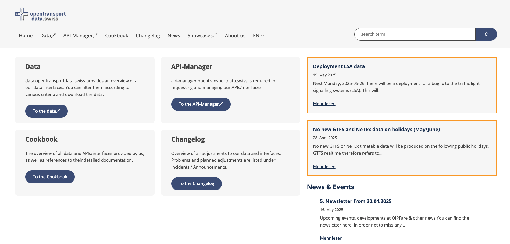
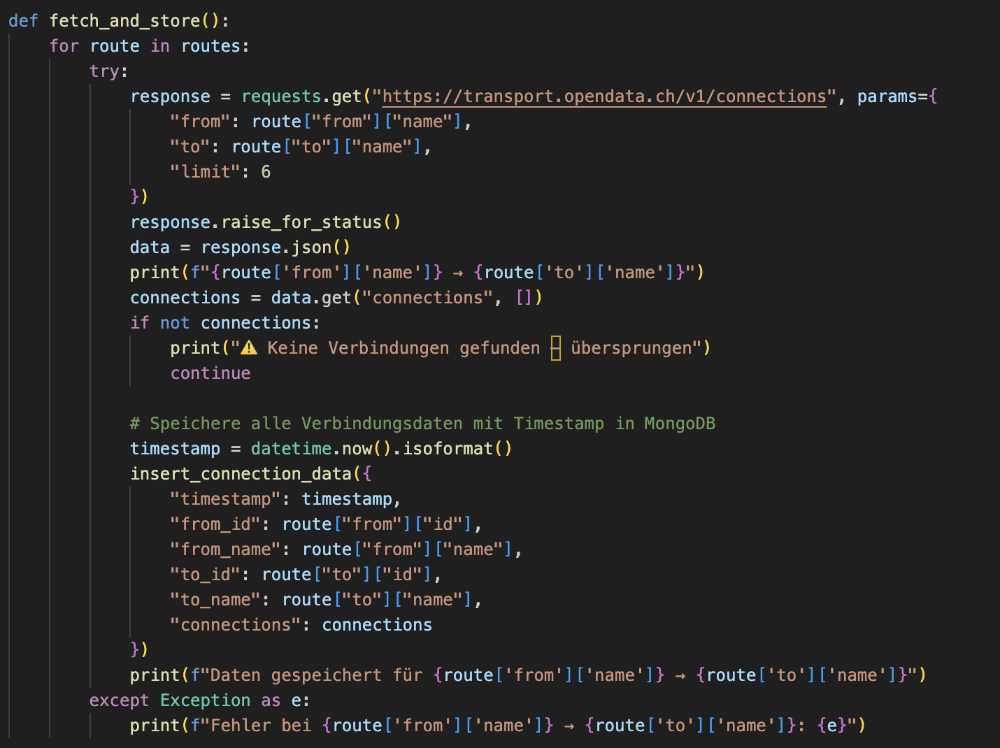
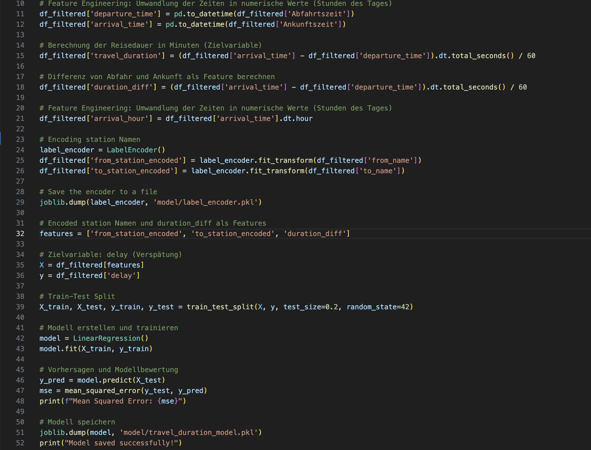
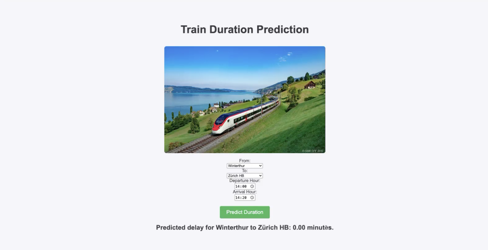
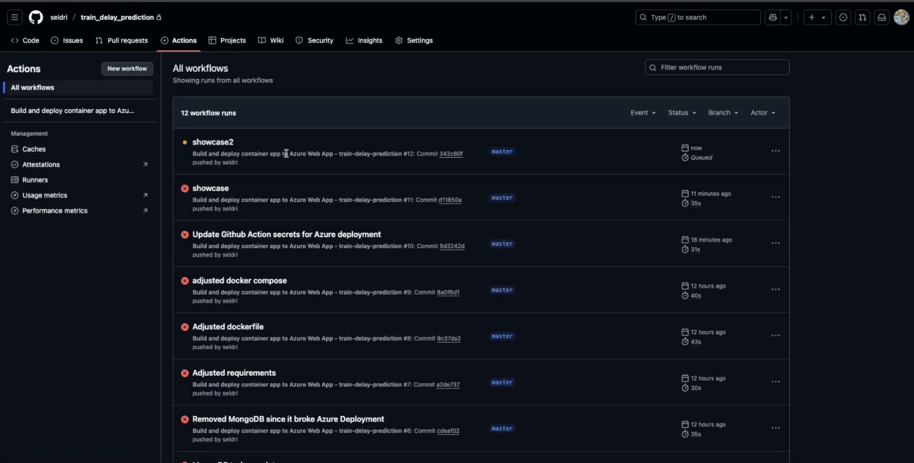
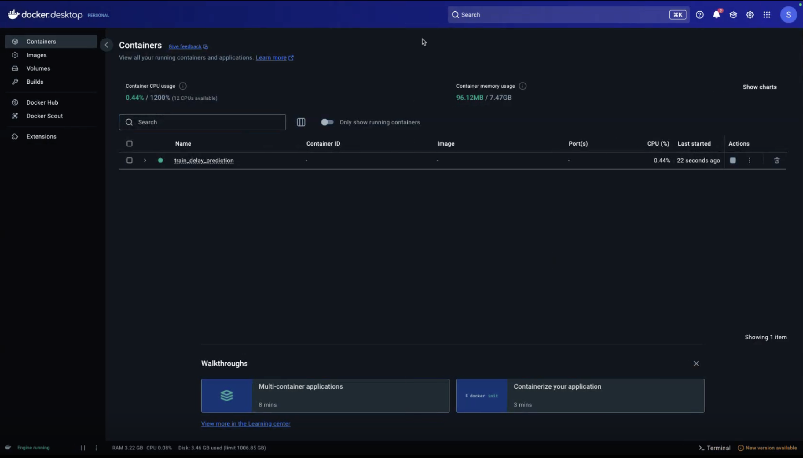
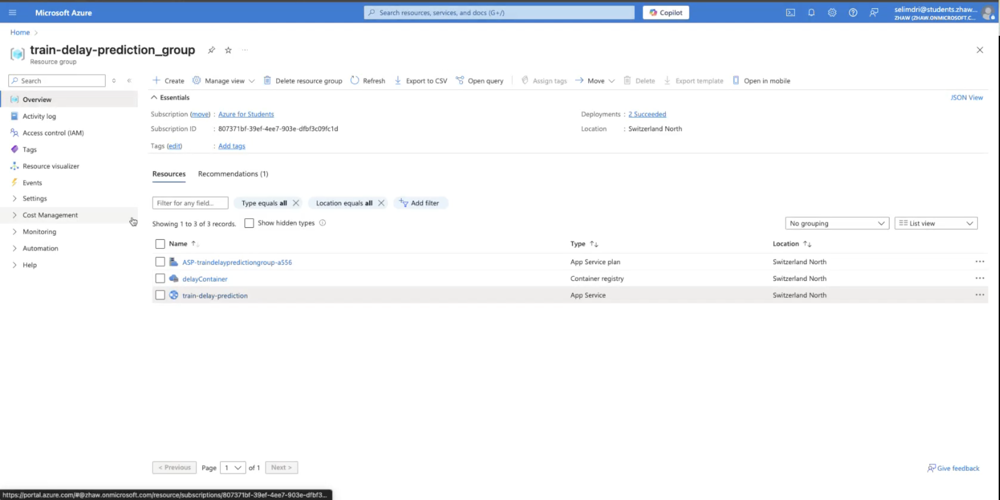
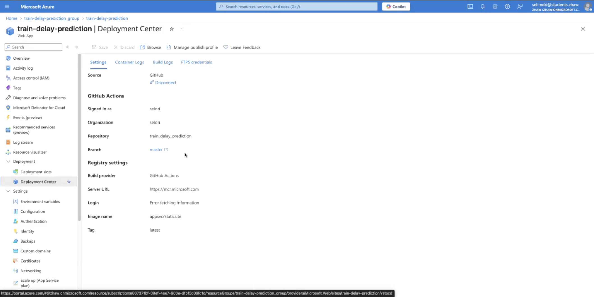
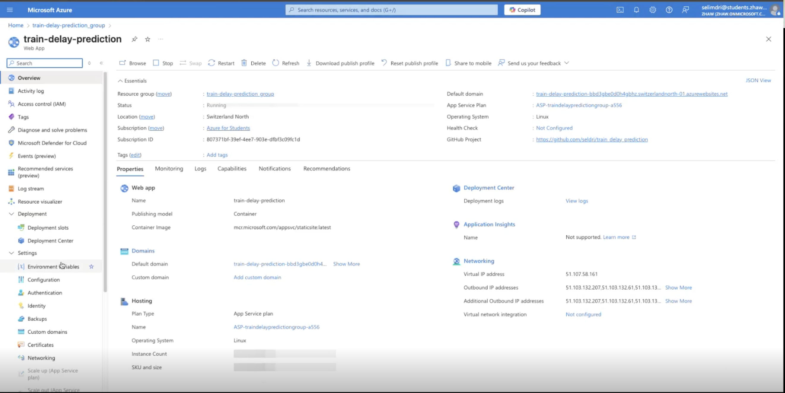

# Projekt 1 Python

## Übersicht

| | Bitte ausfüllen |
| -------- | ------- |
| Variante | Eigenes Projekt |
| Datenherkunft | NeTEx Timetable (OpenTransportData Schweiz) |
| Datenquelle | https://opentransportdata.swiss/ |
| ML-Algorithmus | Lineare Regression zur Verspätungsprognose |
| Repo URL | https://github.com/seldri/train_delay_prediction.git

## Dokumentation

### 1. Data Scraping

1. Die Daten wurden einmalig über die OpenTransportData-API geladen. Es wurden Verbindungsdaten zwischen folgenden Bahnhöfen extrahiert:
   - Winterthur – Zürich HB  
   - Zürich HB – Bern  
   - Bern – Lausanne

   

2. Dabei wurde auf das NeTEx-Timetable-Format zurückgegriffen. Die Rohdaten wurden zunächst in eine **MongoDB**-Datenbank gespeichert.

3. Ein Python-Skript extrahierte anschließend die Daten aus MongoDB und konvertierte sie in ein strukturiertes Pandas-DataFrame:

   

   ```python
   df['delay_minutes'] = (df['actual_arrival'] - df['planned_arrival']).dt.total_seconds() / 60
   ```

4. Zusätzlich wurde darauf geachtet, Daten aus verschiedenen Wochentagen und Uhrzeiten zu laden, um eine aussagekräftige Trainingsbasis zu schaffen.

---

### 2. Training

1. Die CSV-Daten wurden in ein Pandas-DataFrame geladen. Als Zielvariable wurde die Differenz zwischen geplanter und tatsächlicher Ankunftszeit verwendet.

   

2. Feature Engineering:
   - Uhrzeit in numerische Features (z. B. Stunde, Minute)
   - Kodierung der Bahnhöfe
   - Entfernung fehlerhafter Einträge

3. Trainingsaufteilung mit `train_test_split`:

   ```python
   from sklearn.model_selection import train_test_split
   X_train, X_test, y_train, y_test = train_test_split(X, y, test_size=0.2, random_state=42)
   ```

4. Modelltraining:

   ```python
   from sklearn.linear_model import LinearRegression
   model = LinearRegression()
   model.fit(X_train, y_train)
   ```

5. Modellbewertung:

   ```python
   from sklearn.metrics import mean_squared_error
   y_pred = model.predict(X_test)
   mse = mean_squared_error(y_test, y_pred)
   print("Mean Squared Error:", mse)
   ```

6. Modell speichern:

   ```python
   import joblib
   joblib.dump(model, 'model/travel_duration_model.pkl')
   ```

---

### 3. Backend

1. Flask-App zur Vorhersage:

   ```python
   from flask import Flask, request, jsonify
   import joblib
   import pandas as pd

   app = Flask(__name__)
   model = joblib.load('model/travel_duration_model.pkl')

   @app.route('/api/predict', methods=['POST'])
   def predict():
       data = request.get_json()
       df = pd.DataFrame([data])
       prediction = model.predict(df)[0]
       return jsonify({'prediction': round(prediction, 2)})
   ```

---

### 4. Frontend

1. Die Weboberfläche wurde mit einfachem HTML gestaltet und erlaubt:
   - Auswahl von Strecke
   - Eingabe der Uhrzeit
   - Ausgabe der Vorhersage

   

---

### 5. ModelOps Automation

1. GitHub Actions wurde für automatisiertes Training und Deployment eingerichtet.

   

---

### 6. Deployment

#### Docker

1. Lokales Testen der Anwendung mit Docker Desktop:

   

#### Azure

1. Azure-Ressourcen wurden erstellt:

   

2. Verbindung zu GitHub wurde erfolgreich eingerichtet:

   

3. Container-Setup:

   

4. **Wichtiger Hinweis:**  
   Aufgrund eines Fehlers bei GitHub Actions konnte das Deployment nicht vollständig abgeschlossen werden. Die Verbindung zu Azure und das Container-Building waren erfolgreich, jedoch wurde der letzte Schritt – das tatsächliche Bereitstellen des Containers auf Azure – durch einen Pipeline-Fehler verhindert.

5. Die Anwendung ist daher **nicht online erreichbar**, obwohl die Infrastruktur vollständig vorbereitet wurde.
