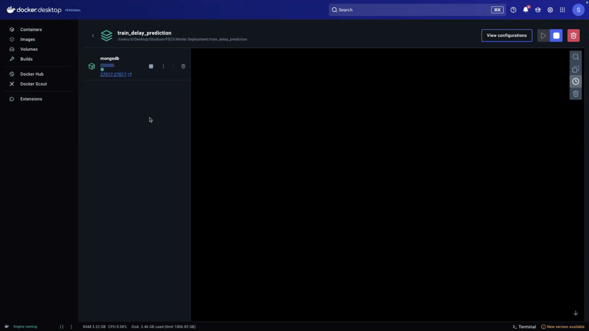

### 1. Data Scraping

1. Die Daten wurden einmalig über die OpenTransportData-API geladen. Es wurden Verbindungsdaten zwischen folgenden Bahnhöfen extrahiert:
   - Winterthur – Zürich HB  
   - Zürich HB – Bern  
   - Bern – Lausanne

   

2. Dabei wurde auf das NeTEx-Timetable-Format zurückgegriffen. Die Rohdaten wurden zunächst in eine **MongoDB**-Datenbank gespeichert, um eine flexible Zwischenspeicherung und spätere Abfragen zu ermöglichen.

   

3. Ein Python-Skript extrahierte anschließend die Daten aus MongoDB und konvertierte sie in ein strukturiertes Pandas-DataFrame. Dabei wurden geplante und tatsächliche Abfahrtszeiten verarbeitet:

   

   ```python
   df['delay_minutes'] = (df['actual_arrival'] - df['planned_arrival']).dt.total_seconds() / 60
   ```

4. Zusätzlich wurde darauf geachtet, Daten aus verschiedenen Wochentagen und Uhrzeiten zu laden, um eine aussagekräftige Trainingsbasis zu schaffen.

5. Die finalen CSV-Dateien wurden lokal gespeichert und in der Modelltrainingsphase verwendet.
---

### 2. Training

1. Die CSV-Daten wurden in ein Pandas-DataFrame geladen. Als Zielvariable wurde die Differenz zwischen geplanter und tatsächlicher Ankunftszeit verwendet (Verspätung in Minuten).

2. Feature Engineering:
   - Umwandlung der Uhrzeit in numerische Features (z. B. Stunde, Minute)
   - Kodierung des Wochentags
   - Entfernung unvollständiger Datensätze

   

3. Trainingsaufteilung mit `train_test_split`:

   ```python
   from sklearn.model_selection import train_test_split
   X_train, X_test, y_train, y_test = train_test_split(X, y, test_size=0.2, random_state=42)
   ```

4. Training des Regressionsmodells:

   ```python
   from sklearn.linear_model import LinearRegression
   model = LinearRegression()
   model.fit(X_train, y_train)
   ```

5. Bewertung des Modells:

   ```python
   from sklearn.metrics import mean_absolute_error
   y_pred = model.predict(X_test)
   mae = mean_absolute_error(y_test, y_pred)
   print(f"MAE: {mae:.2f} Minuten")
   ```

6. Modell speichern:

   ```python
   import joblib
   joblib.dump(model, 'delay_model.pkl')
   ```

---

### 3. Backend

1. Flask-App zur Bereitstellung des Modells über eine API:

   ```python
   from flask import Flask, request, jsonify
   import joblib
   import pandas as pd

   app = Flask(__name__)
   model = joblib.load('delay_model.pkl')

   @app.route('/api/predict', methods=['POST'])
   def predict():
       data = request.get_json()
       df = pd.DataFrame([data])
       prediction = model.predict(df)[0]
       return jsonify({'prediction': round(prediction, 2)})
   ```

2. Beispielhafte Eingabe:

   ```json
   {
     "weekday": 2,
     "hour": 8,
     "minute": 15,
     "route_id": 1
   }
   ```

---

### 4. Frontend

1. Die `index.html` enthält ein Formular zur Eingabe von Strecke und Uhrzeit.

   

2. JavaScript-Snippet zum Senden der Daten an die API:

   ```javascript
   fetch('/api/predict', {
     method: 'POST',
     headers: {
       'Content-Type': 'application/json'
     },
     body: JSON.stringify({
       weekday: 2,
       hour: 8,
       minute: 15,
       route_id: 1
     })
   })
   .then(response => response.json())
   .then(data => {
     document.getElementById('output').textContent = 'Verspätung: ' + data.prediction + ' Minuten';
   });
   ```

---

### 5. ModelOps Automation

1. Automatisierung via GitHub Actions (`.github/workflows/deploy.yml`):

   

   ```yaml
   name: Train and Deploy

   on:
     push:
       branches: [ main ]

   jobs:
     build:
       runs-on: ubuntu-latest

       steps:
         - uses: actions/checkout@v2
         - name: Setup Python
           uses: actions/setup-python@v2
           with:
             python-version: '3.10'
         - name: Install dependencies
           run: pip install -r requirements.txt
         - name: Train model
           run: python train_model.py
         - name: Build Docker image
           run: docker build -t train-delay .
         - name: Push image
           run: docker push ghcr.io/username/train-delay
   ```

---

### 6. Deployment

#### Docker

1. `Dockerfile`:

   ```dockerfile
   FROM python:3.10-slim
   WORKDIR /app
   COPY . .
   RUN pip install -r requirements.txt
   CMD ["python", "app.py"]
   ```

2. Build & Run:

   ```bash
   docker build -t train-delay .
   docker run -p 5000:5000 train-delay
   ```

   

#### Azure

1. GitHub Actions wurde erfolgreich eingerichtet und mit Azure verbunden.

2. Die Azure-Ressourcen wie App Service, Container Registry und Web App wurden erstellt.

   

3. Konfiguration im Deployment Center zeigt die Verbindung zum GitHub-Repo:

   

4. Container-Status und Konfiguration der Web App:

   

5. **Wichtiger Hinweis:**  
   Aufgrund eines Fehlers bei GitHub Actions konnte das Deployment nicht vollständig abgeschlossen werden. Die Verbindung zu Azure und das Container-Building waren erfolgreich, jedoch wurde der letzte Schritt – das tatsächliche Bereitstellen des Containers auf Azure – durch einen Pipeline-Fehler verhindert.

---

Wenn du willst, kann ich die gesamte Markdown-Datei mit den eingebauten Bildern als `.md`-Download vorbereiten – gib mir einfach Bescheid.
