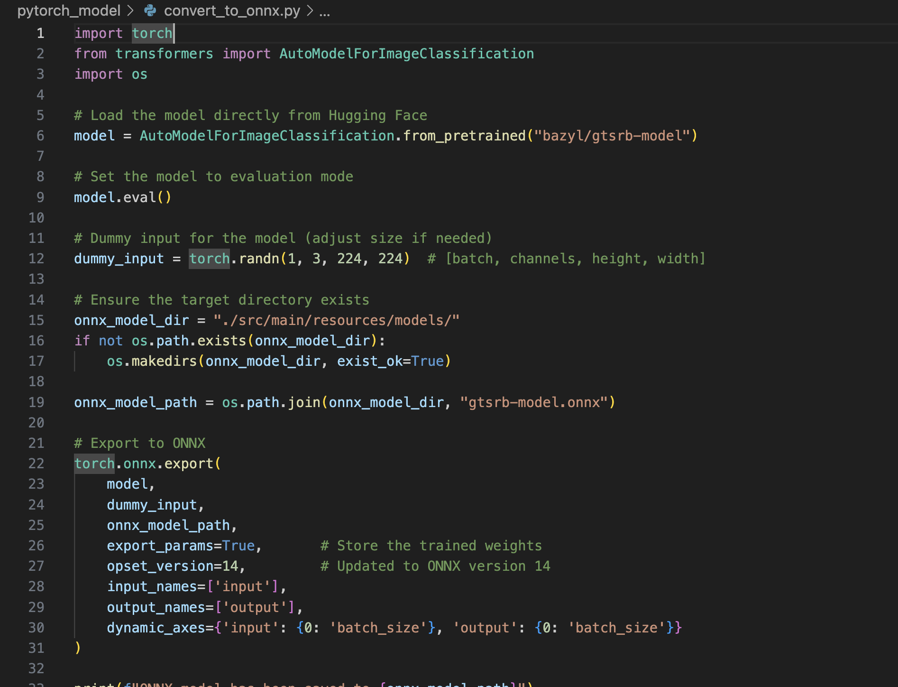
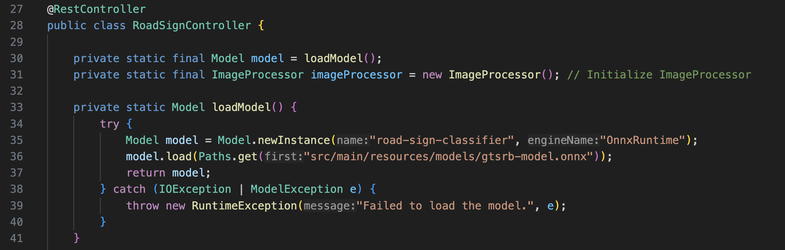
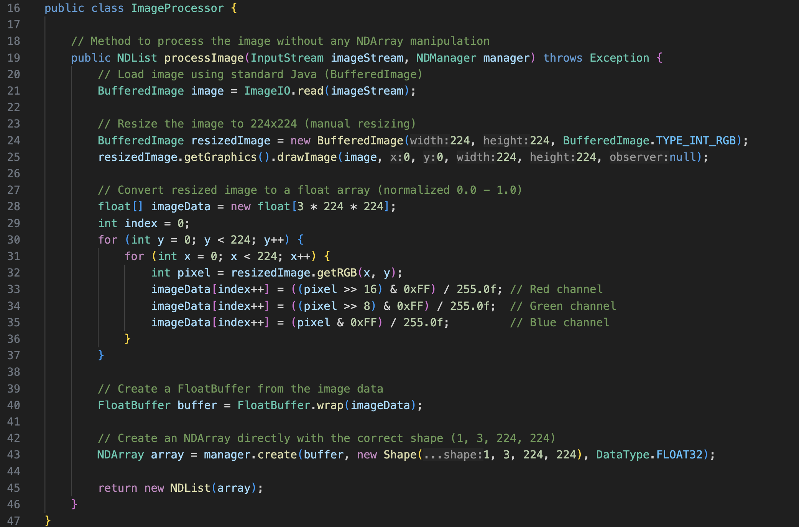
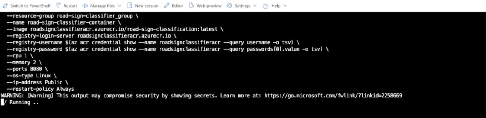

# Projekt Java – Verkehrsschild-Klassifikation

## Übersicht

| | Beschreibung |
| -------- | -------- |
| Variante | Vorgegebenes Modell (bazyl/gtsrb-model), konvertiert und verwendet mit DJL ONNX Runtime |
| Datensatz | [German Traffic Sign Recognition Benchmark (GTSRB)](https://benchmark.ini.rub.de/gtsrb_news.html) |
| Modell | bazyl/gtsrb-model (Vision Transformer), ONNX-Format |
| ML-Algorithmus | Vision Transformer (ViT) |
| Repo URL | [nicht veröffentlicht] |

## Dokumentation

### Daten

1. Verwendet wurde das GTSRB-Dataset, das Verkehrsschilder aus Deutschland beinhaltet.
2. Das Modell wurde via `transformers`-Bibliothek aus Hugging Face geladen.
3. Die konvertierte Version des Modells befindet sich im Projekt unter:

```bash
src/main/resources/models/gtsrb-model.onnx
```

4. Screenshot des Datasets:


### Modell-Konvertierung

Das ursprüngliche PyTorch-Modell wurde mit folgendem Python-Skript in ONNX konvertiert:

```python
torch.onnx.export(
    model,
    dummy_input,
    output_path,
    export_params=True,
    opset_version=14,
    input_names=["pixel_values"],
    output_names=["logits"],
    dynamic_axes={"pixel_values": {0: "batch_size"}, "logits": {0: "batch_size"}}
)
```

Das Modell wurde erfolgreich gespeichert und verwendet:


### Backend – Java Spring Boot

1. Das Modell wird beim Start über DJL geladen:

```java
model = Model.newInstance("onnxruntime");
model.load(Paths.get("src/main/resources/models"), "gtsrb-model");
```

2. Die Inferenz erfolgt über ein `Predictor<Image, Classifications>` Objekt:

```java
Predictor<Image, Classifications> predictor = model.newPredictor(translator);
Classifications result = predictor.predict(image);
```

3. Ein REST-Endpoint wurde erstellt:
```java
@PostMapping("/api/predict")
public ResponseEntity<List<PredictionResult>> predict(@RequestParam("file") MultipartFile file)
```

4. Screenshot des Modell-Ladevorgangs:


5. Der `ImageProcessor` lädt und transformiert das Bild:


### Frontend

1. Das Frontend wurde vollständig mit HTML, CSS und JavaScript erstellt.
2. Es enthält ein responsives Layout mit:
   - Titel, Beschreibung
   - Dateiupload
   - Button zum Auslösen der Klassifikation
   - Bildanzeige

3. Screenshot des Frontends:


### Deployment (optional)

1. Das Projekt kann als Docker Container deployt werden.
2. Eine mögliche Bereitstellung über Azure Container Apps ist vorbereitet.
3. Beispielhafte Screenshots des Azure Deployments:
   - Ressourcen-Gruppe:
     
   - CLI-Befehl:
     
   - Container-Ansicht:
     

---

## Fazit

Dieses Projekt implementiert einen vollständigen Machine-Learning-Prozess zur Klassifikation deutscher Verkehrsschilder:

- Modellkonvertierung (HuggingFace → ONNX)
- Java Spring Boot Backend mit DJL
- Benutzerfreundliches Web-Frontend
- Optionale Bereitstellung in der Cloud

Einsetzbar für Anwendungen in der Mobilität, Fahrsimulation oder Verkehrssicherheit.
