# Projekt 2 Java

## Übersicht

| | Bitte ausfüllen |
| -------- | ------- |
| Variante | Vorhandenes Modell ResNet V1, Netzwerk vollständig selbst trainiert und auf eigenen Datensatz angewendet |
| Datensatz (wenn selbstgewählt) | CUB-200 Birds Dataset, Format: Bilder + Text-Dateien                |
| Datensatz (wenn selbstgewählt) |[https://www.vision.caltech.edu/datasets/cub\_200\_2011/](https://www.vision.caltech.edu/datasets/cub_200_2011/)  | 
| Modell (wenn selbstgewählt) | lokal trainiertes ResNet50 Modell bezogen von DJL Modell-Builder, https://github.com/deepjavalibrary/djl/blob/master/model-zoo/src/main/java/ai/djl/basicmodelzoo/cv/classification/ResNetV1.java  |
| ML-Algorithmus |  ResNet50 + Transfer Learning mit DJL  |
| Repo URL | [https://github.com/yanickfischer/mdm-project2-birdclassification](https://github.com/yanickfischer/mdm-project2-birdclassification) |

## Dokumentation

### Daten

1. Es wurde das CUB-200 Birds Dataset verwendet
2. Die Bilder und Labels wurden für das Training vorbereitet und in einem lokalisierten Ordner gespeichert
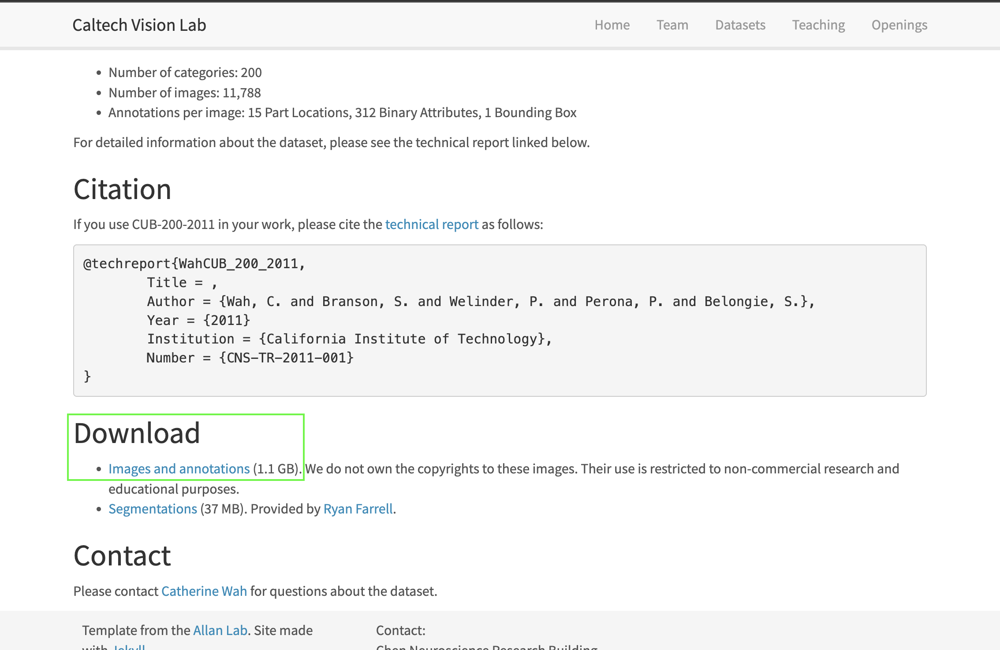

4. Die Labels wurden durch die Datei `synset.txt` definiert, um Rechenleistung zu reduzieren wurde in diesem Projekt bewusst nur mit 20 von total 200 verfügbaren Klassen gearbeitet:

```text
001.Black_footed_Albatross
002.Laysan_Albatross
003.Sooty_Albatross
004.Groove_billed_Ani
005.Crested_Auklet
006.Least_Auklet
007.Parakeet_Auklet
008.Rhinoceros_Auklet
009.Brewer_Blackbird
010.Red_winged_Blackbird
011.Rusty_Blackbird
012.Yellow_headed_Blackbird
013.Bobolink
014.Indigo_Bunting
015.Lazuli_Bunting
016.Painted_Bunting
017.Cardinal
018.Spotted_Catbird
019.Gray_Catbird
020.Yellow_breasted_Chat
```
Hier noch ansichtsweise aus der Coding-Umgebung:
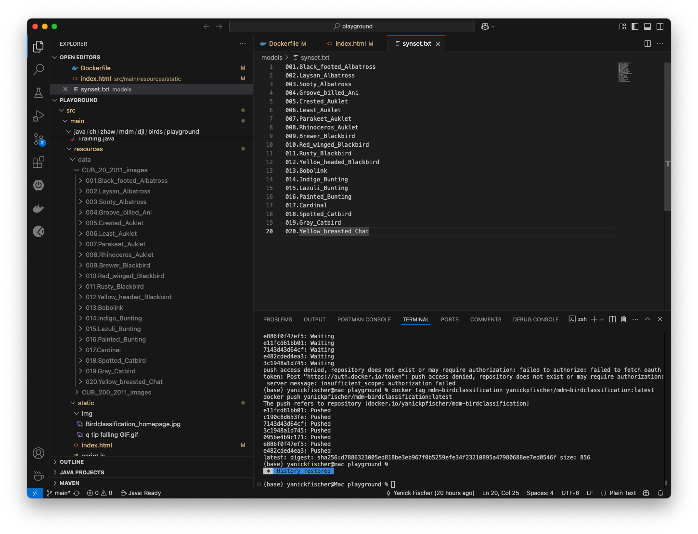

Entsprechend ist das Modell nur auf diese Vogelarten trainiert.
Eine Erweiterung auf die gesammten 200 Klassen, ist aber ohne weiteres möglich.

4. Das Dataset wurde mit Hilfe der `ImageFolder`-Klasse aus der Deep Java Library (DJL) geladen, welche die Ordnerstruktur automatisch als Klassen interpretiert
5. Die maximale Verzeichnistiefe wurde auf 10 gesetzt (`optMaxDepth(10)`), um sicherzustellen, dass auch tieferliegende Klassenzuweisungen erkannt werden

### Training

1. Training wurde über eine Java-Klasse in DJL (Deep Java Library) durchgeführt
2. Die Klasse `Training.java` beinhaltet alle relevanten Schritte (Modell laden, Daten vorbereiten, Training durchführen, speichern).
3. Nach dem Training wurde das Modell als `.params`-Datei gespeichert:

```bash
/models/birdclassifier-0020.params
```

4. Ebenso wurde die `training-results.json` Datei manuell erzeugt zur Anzeige im Frontend:

```json
{
  "train_accuracy": 0.84,
  "train_loss": 0.44,
  "validation_accuracy": 0.42,
  "validation_loss": 3.02
}
```
5. Das Training erfolgt über folgende Schritte in `Training.java`:

   - Es wird ein `ImageFolder`-Dataset geladen, das Bilder rekursiv aus dem Ordner `src/main/resources/data/CUB_20_2011_images` einliest
   - Dabei werden zwei Transformationen angewendet:
     - `Resize(...)` passt alle Bilder auf eine feste Größe (z. B. 224x224 Pixel) an – notwendig, weil neuronale Netze gleich große Eingaben erwarten
     - `ToTensor()` konvertiert die Bilder in numerische Tensor-Daten für das Training
   - Die Datenmenge wird auf 5000 Bilder begrenzt und zufällig in Trainings- (80 %) und Validierungsdaten (20 %) gesplittet
   - Das Modell (`ResNet50`) wird mit einer **Softmax Cross Entropy Loss** und **Accuracy** als Metrik konfiguriert
   - Es wird für **20 Epochen** trainiert – ein typischer Wert, um ein Gleichgewicht zwischen Lernzeit und Overfitting zu finden
   - Nach dem Training wird das Ergebnis (Accuracy und Loss) extrahiert, in `training-results.json` geschrieben und das Modell im `models/`-Verzeichnis gespeichert
  
Hier beispielhaft das Ende des Trainings nach 20 Epochen:
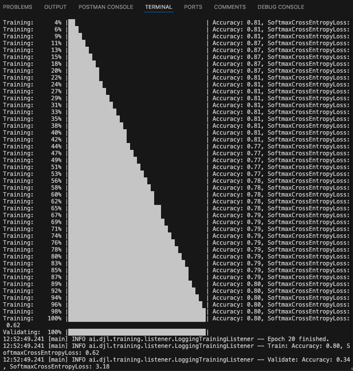

### Inference / Serving

1. Die Klasse `Inference.java` lädt das Modell beim Start:

```java
model.load(Paths.get("models"), "birdclassifier")
```

2. Beim Instanziieren der Klasse wird das Modell aus dem `models/`-Verzeichnis geladen:
```java
model.load(Paths.get("models"), "birdclassifier");
```
3. Dabei wird ein `ImageClassificationTranslator` verwendet, welcher folgende Transformationen anwendet:
   - Das Bild wird auf feste Größe (`Models.IMAGE_WIDTH`, `Models.IMAGE_HEIGHT`) skaliert
   - Umwandlung in Tensor-Format (`ToTensor`)
   - Softmax wird angewendet, um Wahrscheinlichkeiten der Klassen zu erhalten

4. Die Datei `synset.txt` wird automatisch mitgeladen und zur Interpretation der Vorhersagen genutzt.

5. Die Methode `predict(byte[] image)` erhält ein Bild als Byte-Array, wandelt es in ein `Image`-Objekt um und gibt die wahrscheinlichste Klasse zurück:

   ```java
   Classifications predictResult = this.predictor.predict(img);
   ```

6. Das Projekt wird als Spring Boot Anwendung gestartet. Die Hauptklasse `Playground.java` sieht wie folgt aus:

   ```java
   @SpringBootApplication
   public class Playground {
       public static void main(String[] args) {
           SpringApplication.run(Playground.class, args);
       }
   }
   ```

7. Der REST-Controller (`ClassificationController.java`) stellt den Endpunkt `/predict` bereit. Er nimmt POST-Anfragen mit Bilddaten entgegen und ruft die `predict(...)`-Methode aus der `Inference`-Klasse auf.

8. Das Web-Frontend (HTML/JS im `static/`-Verzeichnis) ermöglicht das Hochladen eines Bildes. Dieses wird per `fetch()` als `multipart/form-data` an den REST-Endpunkt `/predict` gesendet.

9. Die Antwort (JSON mit Klassifikation und Wahrscheinlichkeiten) wird vom Frontend entgegengenommen und die Top-Klasse im UI angezeigt.

**Hier sieht man das Ergebnis im Frontent beim lokalen ausführen:**
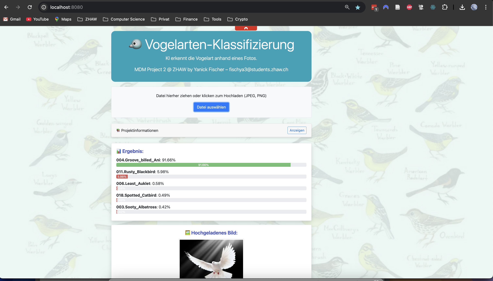

### Deployment

1. Erstellung Dockerimage und Push auf Dockerhub:

```bash
docker buildx create --use
docker buildx build --platform linux/amd64 -t yanickpfischer/mdm-birdclassification:latest --push .
```
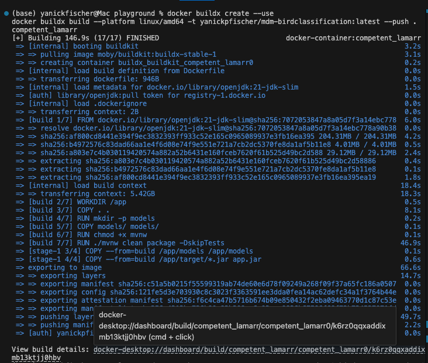
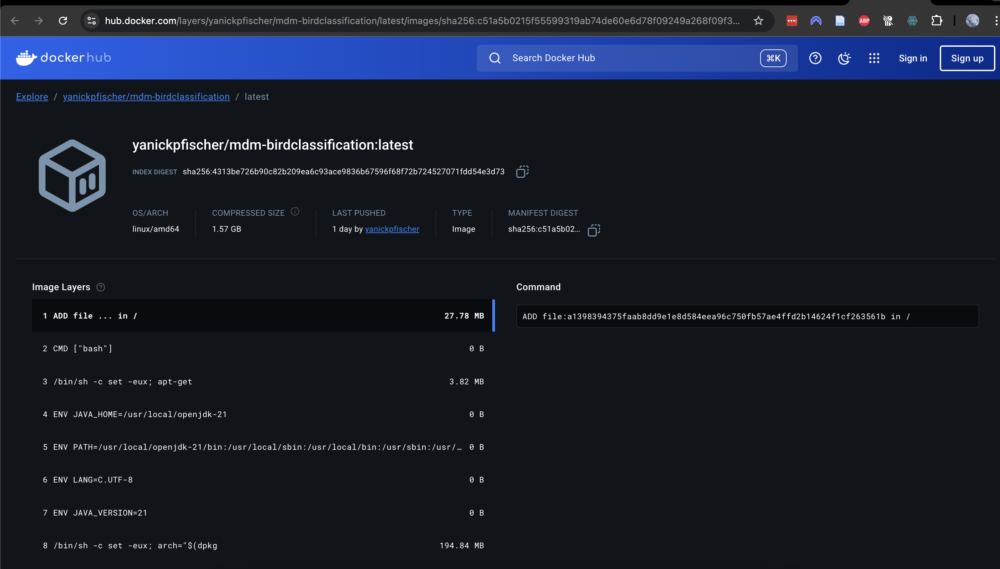

Das Dockerimage ist nun verfügbar und kann erfolgreich ausgeführt werden

2. Azure Ressourcengruppe erstellen:
```bash
az login
```

```bash
az group create \
  --name mdm-p2-bird-rg \
  --location westeurope
```
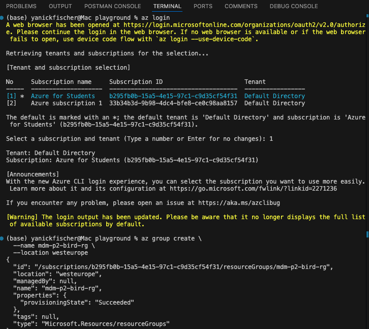

3. Azure App Service Plan erstellen:

```bash
az appservice plan create \
  --name mdm-p2-bird-plan \
  --resource-group mdm-p2-bird-rg \
  --sku F1 \
  --is-linux
```
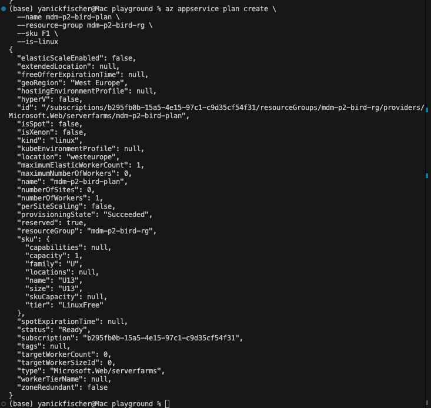

4. Azure Web App erstellen mit Docker Container:

```bash
az webapp create \
  --resource-group mdm-p2-bird-rg \
  --plan mdm-p2-bird-plan \
  --name mdm-p2-bird-app \
  --deployment-container-image-name yanickpfischer/mdm-birdclassification:latest
```
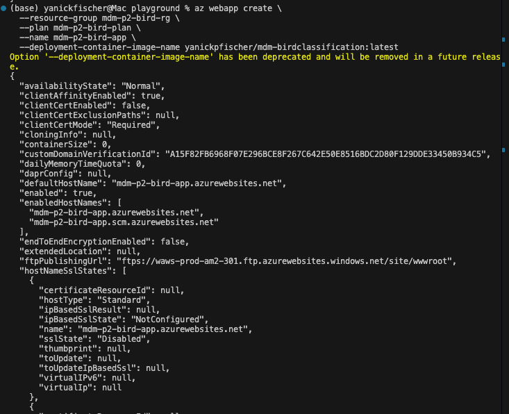


5. Port 8080 konfigurieren:

```bash
az webapp config appsettings set \
  --resource-group mdm-p2-bird-rg \
  --name mdm-p2-bird-app \
  --settings WEBSITES_PORT=8080
```

6. Zugriff auf Anwendung über:

```text
https://mdm-p2-bird-app.azurewebsites.net
```

Die App läuft sauber in Azure, hier ein paar Ansichten aus der App, hier die Startseite vor User Interaktion:

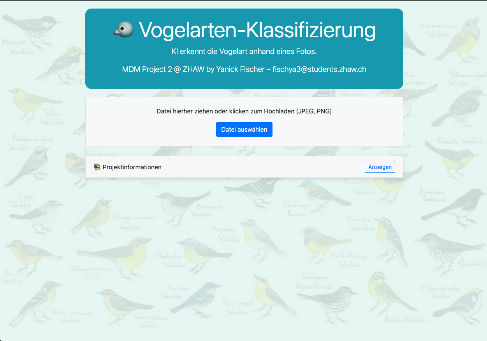

Durch anwählen von `Anzeigen` bei Projektinformationen, sieht der User schon die wichtigsten Infos:

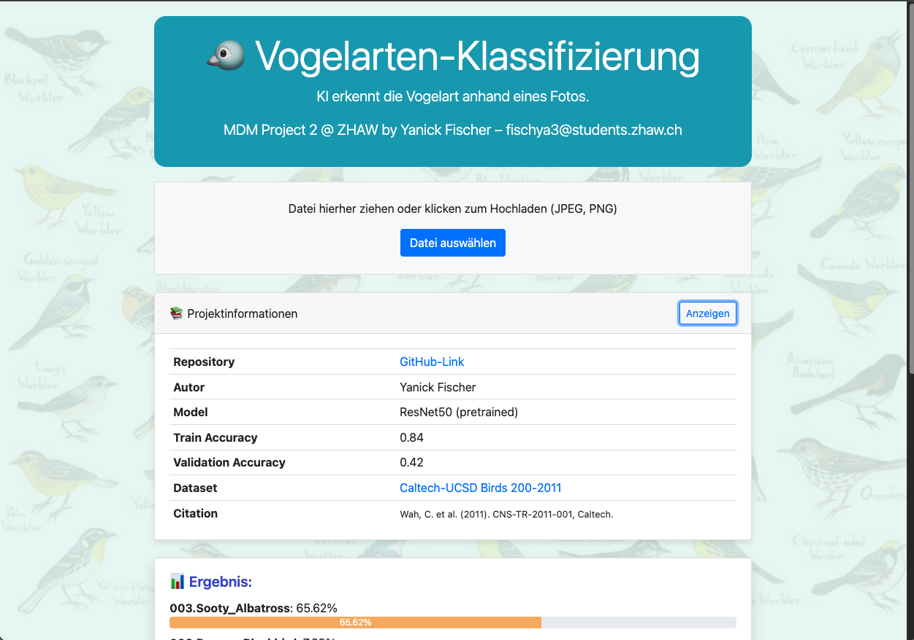


**Der komplette Ablauf besteht aus:**

1.Benutzer lädt ein Bild hoch
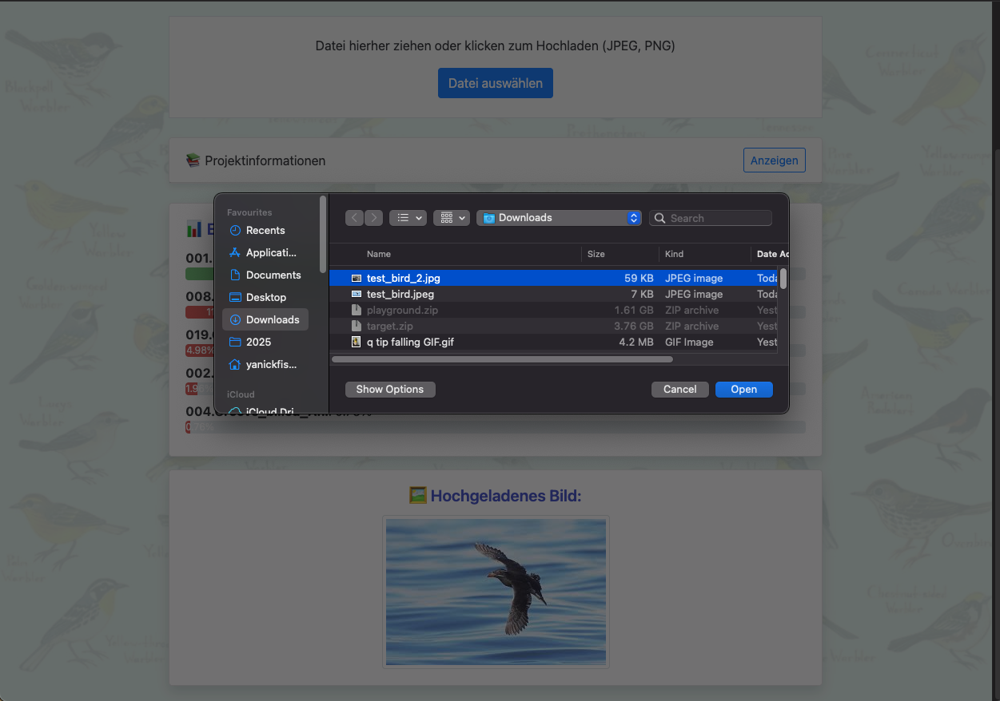

2. Das Bild wird an `/predict` gesendet und dem User wird ein Lade-Gif angezeigt bis das Ergebnis verfügbar ist


3. Das Backend führt Inference aus und sendet das Ergebnis zurück
4. Das Ergebnis wird im Frontend angezeigt

**Beispiel 1: eigentlich die Vogelart Rhinoceros Auklet**
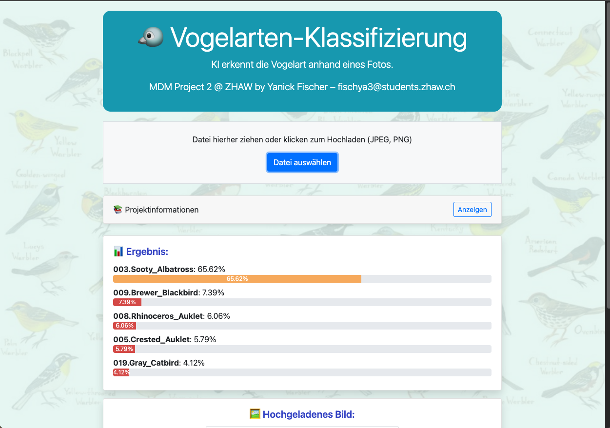
 

**Beispiel 2: eigentlich die Vogelart "Bobolink"**
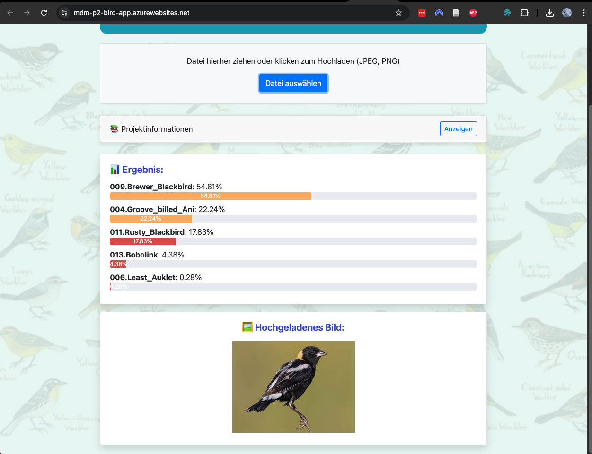
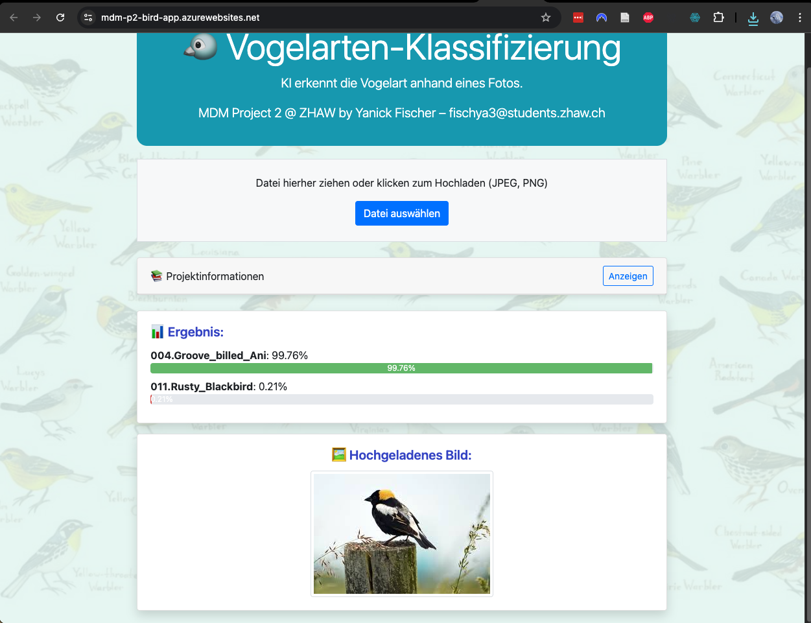


